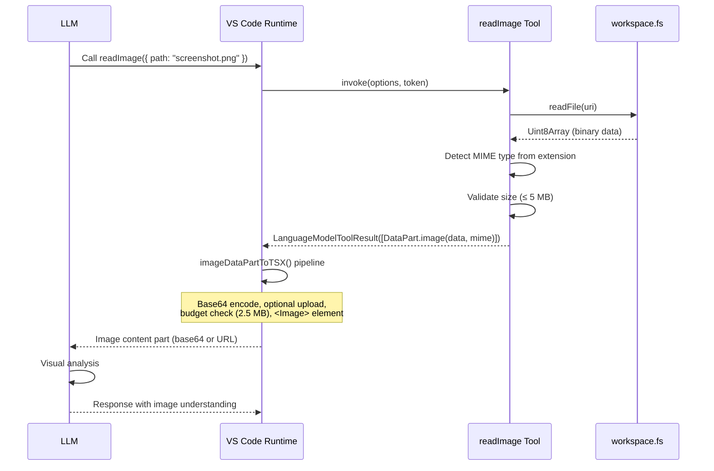

# Read Image LM Tool — Implementation Plan

> A 3rd-party VS Code extension that registers a Language Model Tool allowing Copilot (and any LM-powered chat participant) to **read image files autonomously** during agentic loops.

## Problem Statement

Copilot Chat's built-in `readFile` tool (`copilot_readFile`) is text-only. It reads files via `TextDocumentSnapshot.getText()` — no binary detection, no MIME checking. When the model invokes it against an image, the result is garbled text. The model has **no autonomous mechanism** to inspect image files during agentic work.

Images reach the model today via two paths:

1. **User attachment** — drag-and-drop or `#file:image.png` references. Processed through `ChatReferenceBinaryData` → `<Image>` prompt element → base64/upload → wire format.
2. **Notebook cell outputs** — `getNotebookCellOutputTool` and `runNotebookCellTool` extract `image/png` / `image/jpeg` from cell outputs and return them as `LanguageModelDataPart.image()`.

Neither path allows the model to **decide** to read an arbitrary image file from the workspace. This extension fills that gap.

## Architecture Overview

```
┌──────────────────────────────────────────────────┐
│                  Copilot Chat                     │
│                                                   │
│  Tool-calling loop:                               │
│    1. Model decides to call readImage tool        │
│    2. VS Code invokes tool.invoke()               │
│    3. Tool reads file via workspace.fs.readFile()  │
│    4. Tool returns LanguageModelDataPart.image()   │
│    5. Copilot processes image via                  │
│       imageDataPartToTSX() pipeline               │
│    6. Image reaches model as base64 content_part   │
│                                                   │
│  Automode vision fallback:                        │
│    If current model lacks vision, automode         │
│    switches to a vision-capable model              │
└──────────────────────────────────────────────────┘
```



## API Surface

Every API used is **stable** (shipped in `vscode.d.ts`, not `vscode.proposed.*.d.ts`):

| API | Stability | Purpose |
|-----|-----------|---------|
| `vscode.lm.registerTool(name, tool)` | Stable | Register the tool with VS Code |
| `vscode.LanguageModelTool<T>` | Stable | Interface to implement |
| `vscode.LanguageModelToolResult` | Stable | Return type from `invoke()` |
| `vscode.LanguageModelDataPart.image(data, mime)` | Stable | Factory for image content parts |
| `vscode.workspace.fs.readFile(uri)` | Stable | Read file as `Uint8Array` |
| `contributes.languageModelTools` | Stable | Package.json contribution point |

No proposed APIs are required for core functionality.

## Implementation Repository

The extension is implemented at: **`/Users/ming/GitRepos/github-ming86/lmtools-read-image`**

| File | Purpose |
|------|---------|
| `src/extension.ts` | Entry point — registers `readImage` via `vscode.lm.registerTool()` |
| `src/tools/readImageTool.ts` | `ReadImageTool` class — the full tool implementation |
| `src/types/index.ts` | `IReadImageParameters` interface, `SupportedImageMime` enum |
| `package.json` | Extension manifest with `contributes.languageModelTools` |
| `README.md` | End-user marketplace documentation |
| `ARCHITECTURE.md` | Technical architecture and design decisions |
| `DEVELOPING.md` | Developer guide for building, testing, and extending |

## Documentation Index

| Document | Description |
|----------|-------------|
| [README.md](README.md) | This document — overview and architecture |
| [01-api-reference.md](01-api-reference.md) | VS Code API surface details and type definitions |
| [02-package-json.md](02-package-json.md) | Extension manifest and tool contribution |
| [03-implementation.md](03-implementation.md) | Full TypeScript implementation with commentary |
| [04-edge-cases.md](04-edge-cases.md) | Edge cases, limitations, and platform constraints |
| [05-testing.md](05-testing.md) | Testing strategy and validation approach |
| [06-internal-patterns.md](06-internal-patterns.md) | Reference patterns from Copilot Chat internals |
