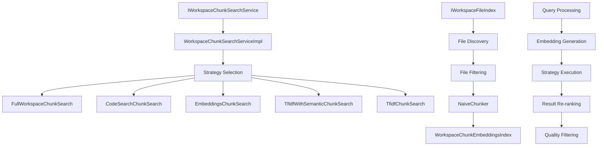

# VS Code Copilot Chat - Indexing System Documentation

## Overview

The VS Code Copilot Chat extension implements a sophisticated multi-tier workspace indexing system designed to enable semantic code search and context-aware AI assistance. The system employs a hierarchical fallback strategy that gracefully degrades from high-performance remote search to local semantic search to keyword-based search, ensuring reliable operation across diverse workspace configurations.

## Key Features

- **Multi-Strategy Architecture**: 5-tier fallback system (Full Workspace → Remote Code Search → Local Embeddings → Hybrid TF-IDF → Pure TF-IDF)
- **Smart File Filtering**: Intelligent exclusion of 100+ file types, binary files, and build artifacts
- **Semantic Search**: Vector embeddings with cosine similarity scoring and re-ranking
- **Performance Optimization**: Multi-level caching, parallel processing, and timeout management
- **Scalability**: Handles workspaces from small projects to enterprise-scale codebases
- **Live Updates**: File system watchers with incremental index updates

## System Architecture

## Core Components

### Service Layer
- **IWorkspaceChunkSearchService**: Main service interface for workspace search operations
- **WorkspaceChunkSearchServiceImpl**: Core implementation with strategy orchestration
- **Strategy Pattern**: Pluggable search strategies with automatic fallback

### File Processing
- **IWorkspaceFileIndex**: File discovery and filtering system
- **NaiveChunker**: Text chunking with structure preservation
- **File Filtering**: Smart exclusion rules and binary detection

### Search Strategies
- **Full Workspace**: Direct inclusion for small workspaces (<100 files)
- **Remote Code Search**: GitHub-powered remote indexing with 12.5s timeout
- **Local Embeddings**: Vector-based semantic search with 8s timeout
- **Hybrid TF-IDF**: Combines keyword search with semantic re-ranking
- **Pure TF-IDF**: Keyword-based fallback search

### Performance Layer
- **Multi-Level Caching**: Memory LRU, SQLite persistence, CDN-based remote cache
- **Parallel Processing**: Concurrent file processing and embedding computation
- **Quality Control**: Distance-based filtering and result limiting

## Documentation Structure

| Document | Description |
|----------|-------------|
| [Architecture](architecture.md) | System design patterns and architectural decisions |
| [Components](components.md) | Detailed breakdown of core components and interfaces |
| [File Processing](file-processing.md) | File discovery, filtering, and chunking implementation |
| [Search Strategies](search-strategies.md) | Search strategy implementations and fallback system |
| [Performance](performance.md) | Optimization techniques and caching strategies |
| [API Reference](api-reference.md) | Technical reference for interfaces and key classes |

## Quick Start

### Understanding the Flow

1. **File Discovery**: System scans workspace and filters indexable files
2. **Chunking**: Files are split into 250-token chunks with structure preservation
3. **Indexing**: Chunks are processed through embeddings or TF-IDF indexing
4. **Query Processing**: Search queries are embedded and matched against index
5. **Result Ranking**: Results are scored and filtered for quality

### Key Configuration

- **Max File Size**: 1.5MB limit for indexable files
- **Max Chunk Size**: 250 tokens per chunk
- **File Limits**: 750-50K files depending on strategy and configuration
- **Quality Threshold**: 65% of top similarity score for result filtering

### Performance Characteristics

- **Full Workspace**: Instant for <100 files
- **Remote Search**: ~12.5s timeout with CDN caching
- **Local Embeddings**: ~8s timeout with incremental updates
- **TF-IDF Search**: Near-instant with SQLite indexing

## Integration Points

### VS Code Extension
- **File System Watchers**: Automatic index updates on file changes
- **Authentication**: GitHub OAuth integration for remote features
- **Progress Reporting**: Real-time indexing progress in chat interface
- **Commands**: Manual indexing triggers and status reporting

### External Services
- **GitHub Code Search**: Remote indexing and search capabilities
- **Embedding Services**: Vector computation with multiple model support
- **CDN Caching**: Pre-computed embeddings for popular repositories

## Development Guidelines

### Adding New Search Strategies
1. Implement `IWorkspaceChunkSearchStrategy` interface
2. Register strategy in `WorkspaceChunkSearchServiceImpl`
3. Add to fallback chain with appropriate timeout
4. Include telemetry and error handling

### Performance Considerations
- File filtering happens before expensive operations
- Parallel processing for independent operations
- Timeout-based strategy racing
- Quality filtering to reduce noise

### Testing
- Simulation test framework in `test/simulation/`
- Strategy-specific test scenarios
- Performance regression testing
- Integration tests with VS Code extension

## Troubleshooting

### Common Issues
- **No Search Results**: Check file filtering rules and ignore patterns
- **Slow Performance**: Verify caching configuration and file limits
- **Authentication Errors**: Ensure GitHub OAuth is properly configured
- **Index Outdated**: Trigger manual re-indexing or check file watchers

### Debugging
- Enable debug logging in `ILogService`
- Monitor telemetry events for strategy selection
- Check index state through `getIndexState()` API
- Use simulation tests for reproducible scenarios

## Contributing

When contributing to the indexing system:

1. **Follow Existing Patterns**: Use established service patterns and interfaces
2. **Add Comprehensive Tests**: Include unit tests and integration scenarios
3. **Document Changes**: Update relevant documentation files
4. **Consider Performance**: Profile changes with large workspaces
5. **Handle Errors Gracefully**: Ensure fallback strategies remain functional

## License

This documentation is part of the VS Code Copilot Chat extension, licensed under the MIT License.