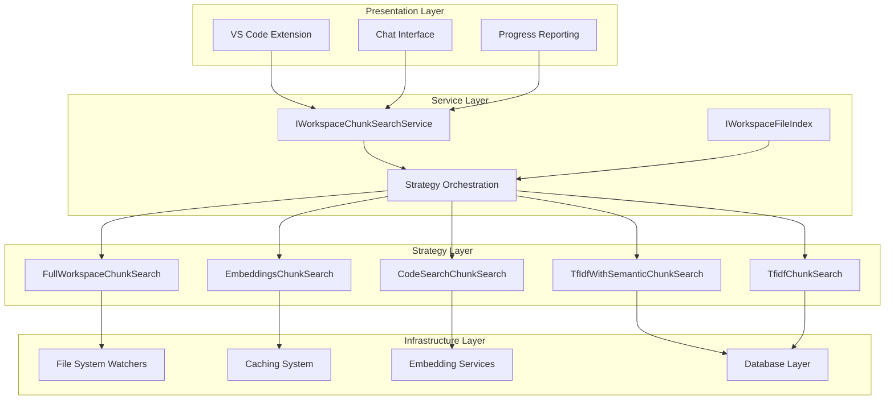
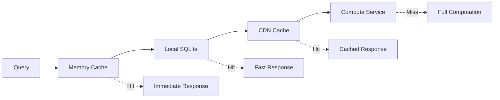

# Architecture Documentation

## System Design Overview

The VS Code Copilot Chat indexing system is built around a **Strategy Pattern** with **hierarchical fallback**, designed for enterprise-scale reliability and performance. The architecture emphasizes graceful degradation, ensuring that workspace search functionality remains available even when optimal strategies fail.

## Core Architectural Patterns

### 1. Strategy Pattern with Fallback Chain

**Location**: `src/platform/workspaceChunkSearch/node/workspaceChunkSearchService.ts:443-476`

The system implements a sophisticated strategy pattern where each search strategy can gracefully fail to the next:

```typescript
// Strategy execution order with timeouts
1. FullWorkspaceChunkSearch     // <100 files, no timeout
2. CodeSearchChunkSearch        // Remote, 12.5s timeout  
3. EmbeddingsChunkSearch        // Local vectors, 8s timeout
4. TfIdfWithSemanticChunkSearch // Hybrid, no timeout
5. TfidfChunkSearch            // Pure keyword, no timeout
```

**Design Benefits**:
- **Reliability**: System always provides results, even with network issues
- **Performance**: Fastest available strategy is used automatically
- **Scalability**: Different strategies optimal for different workspace sizes
- **Graceful Degradation**: Quality degrades predictably under stress

### 2. Service-Oriented Architecture

**Location**: `src/platform/workspaceChunkSearch/node/workspaceChunkSearchService.ts:72-95`

```typescript
export interface IWorkspaceChunkSearchService extends IDisposable {
    getIndexState(): Promise<WorkspaceIndexState>;
    hasFastSearch(sizing: StrategySearchSizing): Promise<boolean>;
    searchFileChunks(/* ... */): Promise<WorkspaceChunkSearchResult>;
    triggerLocalIndexing(/* ... */): Promise<Result<true, TriggerIndexingError>>;
    triggerRemoteIndexing(/* ... */): Promise<Result<true, TriggerIndexingError>>;
}
```

**Design Principles**:
- **Interface Segregation**: Clean separation between service interface and implementation
- **Dependency Injection**: All dependencies injected through constructor
- **Event-Driven**: State changes communicated through event system
- **Testability**: Service interfaces enable comprehensive mocking

### 3. Layered Architecture



## Strategy Pattern Implementation

### Strategy Interface

**Location**: `src/platform/workspaceChunkSearch/common/workspaceChunkSearch.ts`

```typescript
export interface IWorkspaceChunkSearchStrategy {
    readonly id: WorkspaceChunkSearchStrategyId;
    
    prepareSearchWorkspace?(
        telemetryInfo: TelemetryCorrelationId, 
        token: CancellationToken
    ): Promise<void>;
    
    searchWorkspace(
        sizing: StrategySearchSizing,
        query: WorkspaceChunkQueryWithEmbeddings,
        options: WorkspaceChunkSearchOptions,
        telemetryInfo: TelemetryCorrelationId,
        token: CancellationToken
    ): Promise<StrategySearchResult | undefined>;
}
```

### Strategy Selection Logic

**Location**: `src/platform/workspaceChunkSearch/node/workspaceChunkSearchService.ts:298-307`

```typescript
async hasFastSearch(sizing: StrategySearchSizing): Promise<boolean> {
    const indexState = await this.getIndexState();
    return (indexState.remoteIndexState.status === 'loaded' && 
            indexState.remoteIndexState.repos.length > 0) ||
           indexState.localIndexState.status === LocalEmbeddingsIndexStatus.Ready ||
           await this._fullWorkspaceChunkSearch.mayBeAvailable(sizing);
}
```

**Selection Criteria**:
- **Workspace Size**: File count determines initial strategy eligibility
- **Index State**: Availability of pre-computed indexes
- **Authentication**: GitHub auth status for remote features
- **Network Conditions**: Timeout handling for remote services

### Racing and Timeout Management

**Location**: `src/platform/workspaceChunkSearch/node/workspaceChunkSearchService.ts:483-511`

```typescript
private async runSearchStrategyWithFallback(
    mainStrategy: IWorkspaceChunkSearchStrategy,
    fallback: () => CancelablePromise<StrategySearchOutcome>,
    mainTimeout: number,
    // ... other parameters
): Promise<StrategySearchOutcome> {
    const mainOp = createCancelablePromise(/* ... */);
    const mainResult = await raceTimeout(mainOp, mainTimeout);
    
    if (mainResult?.isOk()) {
        return mainResult;
    }
    
    // Fallback but continue main operation
    const fallBackOp = fallback();
    return this.raceSearchOperations([mainOp, fallBackOp]);
}
```

**Racing Benefits**:
- **Performance**: Best available strategy wins
- **Reliability**: Multiple strategies run in parallel
- **Resource Optimization**: Slower operations cancelled when faster completes
- **User Experience**: Immediate results when possible

## Event-Driven Architecture

### State Change Events

**Location**: `src/platform/workspaceChunkSearch/node/workspaceChunkSearchService.ts:251-259`

```typescript
this._register(
    Event.debounce(
        Event.any(
            this._embeddingsChunkSearch.onDidChangeIndexState,
            this._codeSearchChunkSearch.onDidChangeIndexState
        ),
        () => { },
        250
    )(() => this._onDidChangeIndexState.fire()));
```

**Event System Benefits**:
- **Loose Coupling**: Components communicate through events
- **Reactive UI**: Interface updates automatically on state changes
- **Debouncing**: Prevents excessive event firing during rapid changes
- **Composability**: Multiple event sources combined cleanly

### File System Integration

**Location**: `src/platform/workspaceChunkSearch/node/workspaceFileIndex.ts`

The system integrates deeply with VS Code's file system:

- **File Watchers**: Automatic detection of file changes
- **Live Documents**: Integration with open text editors
- **Change Debouncing**: 60-second delay for re-indexing after changes
- **Resource Management**: Proper disposal of watchers and subscriptions

## Caching Architecture

### Multi-Level Caching Strategy



**Cache Levels**:
1. **Memory (LRU)**: Instant access for recent queries
2. **Local SQLite**: Persistent storage for embeddings/TF-IDF
3. **CDN Cache**: Pre-computed embeddings for popular repositories
4. **Remote Compute**: Full embedding computation when needed

### Cache Coherency

**Location**: `src/platform/workspaceChunkSearch/node/workspaceChunkEmbeddingsIndex.ts`

- **Version Management**: Embedding model versions tracked
- **Incremental Updates**: Only changed files re-indexed
- **Cache Invalidation**: File changes trigger selective cache updates
- **Consistency Guarantees**: Read-after-write consistency for local operations

## Error Handling and Resilience

### Graceful Degradation

The architecture ensures system availability through:

1. **Strategy Fallback**: Automatic fallback to simpler strategies
2. **Timeout Management**: Bounded wait times prevent hanging
3. **Error Isolation**: Strategy failures don't affect other strategies  
4. **Quality Thresholds**: Poor results filtered rather than failing

### Error Recovery

**Location**: `src/platform/workspaceChunkSearch/node/workspaceChunkSearchService.ts:592-618`

```typescript
private async runSearchStrategy(/* ... */): Promise<StrategySearchOutcome> {
    try {
        // Attempt strategy execution
    } catch (e) {
        if (isCancellationError(e)) {
            throw e; // Propagate cancellation
        }
        
        this._logService.logger.error(e, `Error during ${strategy.id} search`);
        return Result.error<StrategySearchErr>({
            errorDiagMessage: `${strategy.id} error: ` + e,
        });
    }
}
```

**Recovery Mechanisms**:
- **Exception Isolation**: Strategy errors don't propagate
- **Detailed Logging**: Comprehensive error information for debugging
- **Telemetry Integration**: Error patterns tracked for improvement
- **User-Friendly Fallback**: Always provide some search results

## Performance Architecture

### Parallel Processing

**Location**: `src/platform/workspaceChunkSearch/node/workspaceChunkSearchService.ts:513-563`

```typescript
private async raceSearchOperations(
    ops: readonly CancelablePromise<StrategySearchOutcome>[]
): Promise<StrategySearchOutcome> {
    // Cancel other operations when one succeeds
    for (const op of ops) {
        op.then(result => {
            if (result.isOk()) {
                ops.forEach(op => op.cancel());
            }
        }, () => { });
    }
    
    return Promise.allSettled(ops);
}
```

### Resource Management

- **Bounded Parallelism**: Limits on concurrent operations
- **Memory Management**: LRU caches with size limits
- **File Handle Management**: Proper resource disposal
- **Background Processing**: Non-blocking index updates

## Integration Architecture

### VS Code Extension Integration

**Location**: `src/extension/extension/vscode-node/services.ts:61-62`

The indexing system integrates with VS Code through:

- **Service Registration**: Dependency injection container
- **Command Registration**: Manual indexing triggers
- **Status Integration**: Progress reporting in chat interface
- **Authentication Flow**: GitHub OAuth integration

### External Service Integration

**GitHub Code Search**:
- **Authentication**: OAuth token management
- **API Integration**: RESTful API calls with retry logic
- **Rate Limiting**: Respect API quotas and limits
- **Error Handling**: Graceful degradation on service unavailability

**Embedding Services**:
- **Model Selection**: Support for multiple embedding models
- **Batch Processing**: Efficient bulk embedding computation
- **Streaming**: Progressive result delivery
- **Versioning**: Model version compatibility management

## Scalability Considerations

### Workspace Size Handling

| Workspace Size | Strategy | Characteristics |
|---------------|----------|-----------------|
| <100 files | Full Workspace | Complete file inclusion |
| 100-750 files | Automatic Embeddings | Background indexing |
| 750-2.5K files | Manual Embeddings | User-triggered indexing |
| 2.5K-25K files | TF-IDF + Semantic | Hybrid approach |
| >25K files | TF-IDF Only | Keyword-based search |

### Resource Scaling

- **Memory Usage**: Proportional to active workspace size
- **Disk Usage**: SQLite databases with size management
- **Network Usage**: CDN caching reduces bandwidth requirements
- **CPU Usage**: Background processing with throttling

## Security Architecture

### Data Flow Security

- **Local-First**: Core functionality works without remote services
- **Authentication**: Secure OAuth flows for external services
- **Data Privacy**: No code content sent to external services without consent
- **Access Control**: Respect file system permissions and ignore rules

### Threat Model

**Mitigations**:
- **Input Validation**: File path sanitization and validation
- **Resource Limits**: Bounded memory and disk usage
- **Sandboxing**: Isolated worker processes for heavy operations
- **Audit Trail**: Comprehensive logging for security analysis

## Future Architecture Considerations

### Extensibility Points

1. **New Search Strategies**: Plugin architecture for custom strategies
2. **Custom Embedding Models**: Support for domain-specific models
3. **Alternative Storage**: Pluggable storage backends
4. **External Integrations**: API for third-party search providers

### Evolution Path

- **Microservice Architecture**: Potential service extraction
- **Distributed Caching**: Multi-machine cache coordination
- **Advanced ML**: Semantic understanding beyond embeddings
- **Real-time Updates**: WebSocket-based live indexing