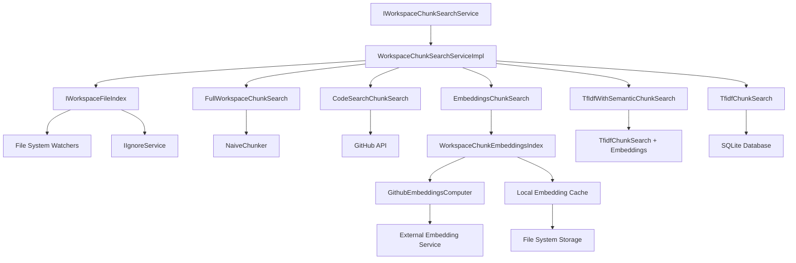

# Components Documentation

## Core Components Overview

The indexing system is built from several key components that work together to provide comprehensive workspace search capabilities. This document provides detailed analysis of each component's responsibilities, interfaces, and implementation details.

## Service Layer Components

### IWorkspaceChunkSearchService

**Location**: `src/platform/workspaceChunkSearch/node/workspaceChunkSearchService.ts:72-95`

The main service interface that orchestrates all workspace search operations.

#### Interface Definition

```typescript
export interface IWorkspaceChunkSearchService extends IDisposable {
    readonly onDidChangeIndexState: Event<void>;
    
    getIndexState(): Promise<WorkspaceIndexState>;
    hasFastSearch(sizing: StrategySearchSizing): Promise<boolean>;
    searchFileChunks(
        sizing: WorkspaceChunkSearchSizing,
        query: WorkspaceChunkQuery,
        options: WorkspaceChunkSearchOptions,
        telemetryInfo: TelemetryCorrelationId,
        progress: vscode.Progress<vscode.ChatResponsePart> | undefined,
        token: CancellationToken,
    ): Promise<WorkspaceChunkSearchResult>;
    triggerLocalIndexing(trigger: BuildIndexTriggerReason, telemetryInfo: TelemetryCorrelationId): Promise<Result<true, TriggerIndexingError>>;
    triggerRemoteIndexing(trigger: BuildIndexTriggerReason, telemetryInfo: TelemetryCorrelationId): Promise<Result<true, TriggerIndexingError>>;
}
```

#### Key Responsibilities

1. **Strategy Orchestration**: Coordinates multiple search strategies with fallback logic
2. **State Management**: Tracks indexing state across local and remote systems
3. **Performance Assessment**: Determines if fast search is available for given parameters
4. **Progress Reporting**: Provides real-time feedback during search operations
5. **Error Handling**: Ensures graceful degradation when strategies fail

#### Implementation: WorkspaceChunkSearchService

**Location**: `src/platform/workspaceChunkSearch/node/workspaceChunkSearchService.ts:110-205`

```typescript
export class WorkspaceChunkSearchService extends Disposable implements IWorkspaceChunkSearchService {
    private _impl: WorkspaceChunkSearchServiceImpl | undefined;
    private readonly _availableEmbeddingTypes: GithubAvailableEmbeddingTypesManager;
    
    constructor(@IInstantiationService private readonly _instantiationService: IInstantiationService) {
        super();
        this._availableEmbeddingTypes = _instantiationService.createInstance(GithubAvailableEmbeddingTypesManager);
        this.tryInit(true);
    }
}
```

**Design Pattern**: **Lazy Initialization** - The service initializes its implementation only when embedding types are available, providing graceful startup behavior.

#### Implementation: WorkspaceChunkSearchServiceImpl

**Location**: `src/platform/workspaceChunkSearch/node/workspaceChunkSearchService.ts:207-804`

The core implementation that manages all search strategies:

```typescript
class WorkspaceChunkSearchServiceImpl extends Disposable implements IWorkspaceChunkSearchService {
    private readonly _embeddingsChunkSearch: EmbeddingsChunkSearch;
    private readonly _fullWorkspaceChunkSearch: FullWorkspaceChunkSearch;
    private readonly _codeSearchChunkSearch: CodeSearchChunkSearch;
    private readonly _tfidfChunkSearch: TfidfChunkSearch;
    private readonly _tfIdfWithSemanticChunkSearch: TfIdfWithSemanticChunkSearch;
}
```

**Key Features**:
- **Strategy Management**: Instantiates and manages all search strategies
- **Event Coordination**: Debounces and forwards state change events
- **Telemetry Integration**: Comprehensive performance and usage tracking
- **Resource Management**: Proper disposal of all resources

### IWorkspaceFileIndex

**Location**: `src/platform/workspaceChunkSearch/node/workspaceFileIndex.ts`

Responsible for discovering and managing indexable files in the workspace.

#### Core Responsibilities

1. **File Discovery**: Recursively finds files suitable for indexing
2. **Filtering Logic**: Applies sophisticated exclusion rules
3. **Change Monitoring**: Watches for file system changes
4. **Binary Detection**: Identifies and excludes binary files
5. **Size Management**: Enforces file size limits

#### File Filtering Implementation

**Location**: `src/platform/workspaceChunkSearch/node/workspaceFileIndex.ts:42-146`

```typescript
const EXCLUDE_EXTENSIONS = new Set([
    // Images: jpg, jpeg, png, gif, bmp, etc.
    // Video: mp4, mkv, webm, mov, avi, etc.
    // Audio: mp3, wav, m4a, flac, ogg, etc.
    // Compressed: 7z, gz, rar, tar, zip, etc.
    // Documents: pdf, doc, xls, ppt, etc.
    // Build artifacts: dll, so, jar, etc.
]);

const EXCLUDED_FOLDERS = [
    'node_modules', 'venv', 'out', 'dist', 
    '.git', '.yarn', '.npm', '.venv'
];
```

**Filtering Logic**:
- **Extension-Based**: 100+ known binary/non-indexable extensions
- **Folder-Based**: Common build output and dependency folders
- **Size-Based**: 1.5MB maximum file size
- **Scheme-Based**: VS Code internal schemes excluded
- **Content-Based**: Binary file detection for unknown extensions

#### Binary File Detection

**Location**: `src/platform/workspaceChunkSearch/node/workspaceFileIndex.ts:7`

```typescript
import { isBinaryFile, isBinaryFileSync } from 'isbinaryfile';
```

Uses the `isbinaryfile` library for content-based binary detection, providing fallback when extension-based filtering is insufficient.

## Chunking Components

### NaiveChunker

**Location**: `src/platform/chunking/node/naiveChunker.ts:21-141`

Responsible for breaking files into manageable, semantically coherent chunks.

#### Configuration

```typescript
export const MAX_CHUNK_SIZE_TOKENS = 250;

interface ChunkOptions {
    maxTokenLength?: number;      // Default: 250 tokens
    removeEmptyLines?: boolean;   // Default: true
}
```

#### Chunking Algorithm

**Location**: `src/platform/chunking/node/naiveChunker.ts:57-115`

```typescript
private async *_processLinesIntoChunks(
    uri: URI,
    text: string,
    maxTokenLength: number,
    shouldDedent: boolean,
    removeEmptyLines: boolean,
    token: CancellationToken,
): AsyncIterable<FileChunk>
```

**Algorithm Features**:
1. **Line-Based Processing**: Preserves natural code boundaries
2. **Token Counting**: Uses actual tokenizer for accurate chunk sizing
3. **Indentation Preservation**: Maintains code structure through dedenting
4. **Incremental Processing**: Streaming approach for large files
5. **Quality Filtering**: Removes empty or low-content chunks

#### Chunk Structure

**Location**: `src/platform/chunking/common/chunk.ts`

```typescript
export interface FileChunk {
    readonly file: URI;
    readonly text: string;        // Processed text for search
    readonly rawText: string;     // Original text for display
    readonly isFullFile: boolean; // True if chunk contains entire file
    readonly range: Range;        // Line-based position in file
}

export interface FileChunkWithEmbedding extends FileChunk {
    readonly embedding: Embedding;
}

export interface FileChunkAndScore extends FileChunk {
    readonly distance?: EmbeddingDistance;
}
```

### Embedding Infrastructure

#### WorkspaceChunkEmbeddingsIndex

**Location**: `src/platform/workspaceChunkSearch/node/workspaceChunkEmbeddingsIndex.ts`

Manages local embedding computation and storage with integration to GitHub's remote embedding service.

**Key Features**:
- **Local Computation**: Background embedding generation
- **Remote Integration**: CDN-based pre-computed embeddings
- **Caching Strategy**: Multi-level caching (memory, disk, remote)
- **Version Management**: Handles embedding model updates
- **Incremental Updates**: Only processes changed files

#### GithubEmbeddingsComputer

**Location**: `src/platform/workspaceChunkSearch/common/githubEmbeddingsComputer.ts`

Handles embedding computation through GitHub's embedding service.

```typescript
export class GithubEmbeddingsComputer implements IEmbeddingsComputer {
    async computeEmbeddings(
        embeddingType: EmbeddingType,
        strings: readonly string[],
        options: { inputType: 'query' | 'document' },
        token: CancellationToken
    ): Promise<Embeddings | undefined>
}
```

**Capabilities**:
- **Batch Processing**: Efficient bulk embedding computation
- **Input Type Specialization**: Different handling for queries vs documents
- **Rate Limiting**: Respects service quotas
- **Error Handling**: Graceful degradation on service issues

## Search Strategy Components

### FullWorkspaceChunkSearch

**Location**: `src/platform/workspaceChunkSearch/node/fullWorkspaceChunkSearch.ts`

Handles small workspaces by including all content directly.

**Strategy**: For workspaces with <100 files, return entire workspace content if within token budget.

**Benefits**:
- **Zero Latency**: No search computation required
- **Complete Context**: AI has access to full workspace
- **High Accuracy**: No information loss from search

### CodeSearchChunkSearch

**Location**: `src/platform/workspaceChunkSearch/node/codeSearchChunkSearch.ts`

Leverages GitHub's remote code search infrastructure.

**Features**:
- **Remote Indexing**: Server-side index computation
- **Repository Integration**: Automatic GitHub repository detection
- **Authentication Flow**: OAuth-based access control
- **Caching**: CDN-based result caching

**Performance**: 12.5s timeout with fallback to local strategies.

### EmbeddingsChunkSearch

**Location**: `src/platform/workspaceChunkSearch/node/embeddingsChunkSearch.ts`

Implements semantic search using vector embeddings.

#### Index Management

```typescript
export interface LocalEmbeddingsIndexState {
    readonly status: LocalEmbeddingsIndexStatus;
    readonly getState: () => Promise<EmbeddingsIndexDetails | undefined>;
}

export enum LocalEmbeddingsIndexStatus {
    Unknown = 'unknown',
    Ready = 'ready',
    UpdatingIndex = 'updating',
    RequiresIndexing = 'requiresIndexing'
}
```

**Indexing Limits**:
- **Automatic**: 750 files (standard), 50K files (expanded)
- **Manual**: 2.5K files (standard), 50K files (expanded)
- **Performance**: 8s timeout for search operations

### TfidfChunkSearch

**Location**: `src/platform/workspaceChunkSearch/node/tfidfChunkSearch.ts`

Implements keyword-based search using Term Frequency-Inverse Document Frequency.

**Implementation**:
- **SQLite Backend**: Persistent index storage
- **Worker Process**: Separate process for heavy computation
- **Incremental Updates**: Efficient index maintenance
- **Fast Queries**: Near-instant search for keyword matches

### TfIdfWithSemanticChunkSearch

**Location**: `src/platform/workspaceChunkSearch/node/tfidfWithSemanticChunkSearch.ts`

Combines TF-IDF keyword search with semantic re-ranking.

**Hybrid Approach**:
1. **Initial Results**: Fast TF-IDF keyword matching
2. **Semantic Re-ranking**: Embedding-based relevance scoring
3. **Quality Filtering**: Distance-based result filtering

**Benefits**:
- **Speed**: Fast initial results from TF-IDF
- **Accuracy**: Improved relevance through semantic scoring
- **Scalability**: Works with large workspaces

## Utility Components

### Query Processing

#### WorkspaceChunkQuery

**Location**: `src/platform/workspaceChunkSearch/common/workspaceChunkSearch.ts`

```typescript
export interface WorkspaceChunkQuery {
    resolveQuery(token: CancellationToken): Promise<string>;
}

export interface WorkspaceChunkQueryWithEmbeddings extends WorkspaceChunkQuery {
    resolveQueryEmbeddings(token: CancellationToken): Promise<Embedding>;
}
```

**Query Processing Pipeline**:
1. **Text Resolution**: Convert query to searchable text
2. **Embedding Generation**: Compute query embeddings in parallel
3. **Strategy Distribution**: Pass to appropriate search strategies
4. **Result Aggregation**: Combine and rank results

### Result Processing

#### Re-ranking System

**Location**: `src/platform/workspaceChunkSearch/node/workspaceChunkSearchService.ts:645-666`

```typescript
private async rerankResultIfNeeded(
    query: WorkspaceChunkQueryWithEmbeddings, 
    result: StrategySearchOk, 
    maxResults: number, 
    telemetryInfo: TelemetryCorrelationId, 
    progress: vscode.Progress<vscode.ChatResponsePart> | undefined, 
    token: CancellationToken
): Promise<WorkspaceChunkSearchResult>
```

**Re-ranking Process**:
1. **Embedding Computation**: Generate embeddings for unscored results
2. **Distance Calculation**: Compute cosine similarity with query
3. **Quality Filtering**: Remove results below 65% of top score
4. **Result Limiting**: Apply token budget and result count limits

### Caching Components

#### Multi-Level Cache Architecture

1. **Memory Cache**: LRU cache for immediate access
2. **SQLite Cache**: Persistent storage for embeddings and TF-IDF data
3. **CDN Cache**: Remote pre-computed embeddings
4. **Version Management**: Cache invalidation on model updates

#### Cache Coherency

- **File Watchers**: Automatic cache invalidation on file changes
- **Incremental Updates**: Only affected chunks re-processed
- **Version Tracking**: Embedding model version compatibility
- **Consistency Guarantees**: Read-after-write consistency for local operations

## Integration Components

### VS Code Extension Integration

**Location**: `src/extension/workspaceChunkSearch/vscode-node/workspaceChunkSearch.contribution.ts`

- **Command Registration**: Manual indexing triggers
- **Status Item**: Real-time indexing progress
- **Progress Reporting**: Chat interface integration
- **Authentication**: GitHub OAuth flow integration

### Telemetry Integration

**Location**: `src/platform/workspaceChunkSearch/node/workspaceChunkSearchService.ts:364-374`

```typescript
this._telemetryService.sendMSFTTelemetryEvent('workspaceChunkSearchStrategy', {
    strategy: searchResult.isOk() ? searchResult.val.strategy : 'none',
    errorDiagMessage: searchResult.isError() ? searchResult.err.errorDiagMessage : undefined,
    workspaceSearchSource: telemetryInfo.callTracker.toString(),
    workspaceSearchCorrelationId: telemetryInfo.correlationId,
}, {
    execTime: searchSw.elapsed(),
    workspaceIndexFileCount: this._workspaceFileIndex.fileCount,
    wasFirstSearchInWorkspace: wasFirstSearchInWorkspace ? 1 : 0,
});
```

**Telemetry Events**:
- **Strategy Selection**: Which search strategy was used
- **Performance Metrics**: Execution times and result counts
- **Error Tracking**: Failure modes and recovery patterns
- **Usage Patterns**: First-time vs repeat usage

## Component Dependencies



## Component Lifecycle

### Initialization Sequence

1. **Service Registration**: Dependency injection container setup
2. **Embedding Type Resolution**: Determine available embedding models
3. **Strategy Instantiation**: Create all search strategy instances
4. **Event Wire-up**: Connect state change events
5. **File Index Initialization**: Start workspace file discovery
6. **Authentication Check**: Verify GitHub OAuth status

### Runtime Operation

1. **Query Reception**: Service receives search request
2. **Strategy Selection**: Determine optimal search strategy
3. **Parallel Execution**: Run strategy with fallback racing
4. **Result Processing**: Re-rank and filter results
5. **Cache Update**: Store results for future queries
6. **Telemetry Reporting**: Log performance and usage metrics

### Shutdown Sequence

1. **Operation Cancellation**: Cancel in-flight operations
2. **Resource Disposal**: Dispose of watchers and subscriptions
3. **Cache Flush**: Persist important cache data
4. **Service Cleanup**: Release all allocated resources