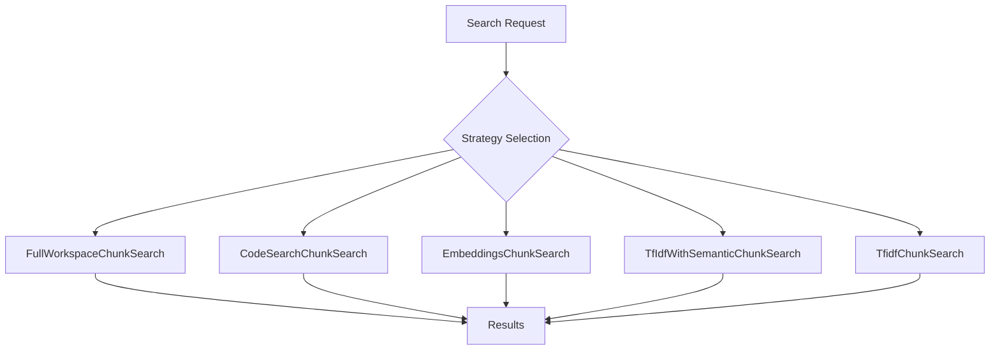
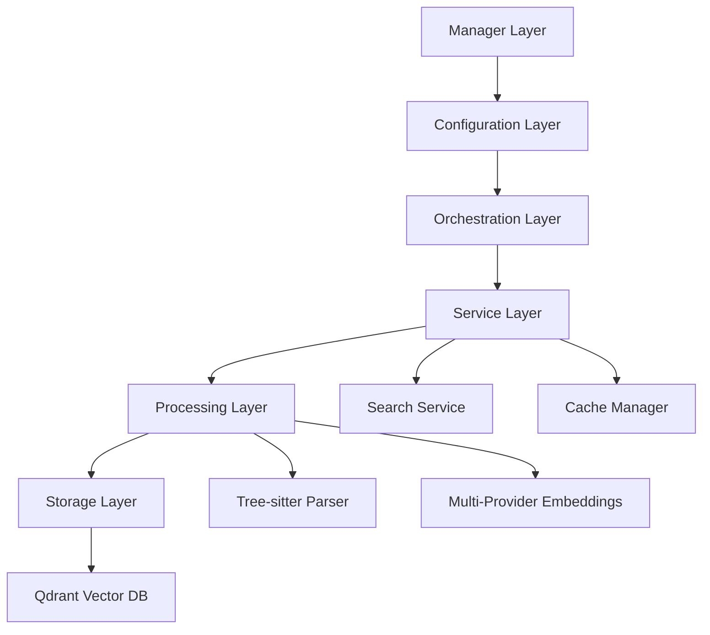

# Code Indexing Implementation Comparative Analysis
## VS Code Copilot Chat vs Roo Code for MCP Server Extraction

---

## Executive Summary

This analysis compares two major semantic code indexing implementations to determine the superior foundation for extracting into a Model Context Protocol (MCP) server targeting individual developers and OSS contributors.

**Winner: Roo Code Implementation** ⭐

The Roo Code implementation emerges as significantly superior for MCP server extraction due to its modular architecture, advanced language support, flexible multi-provider ecosystem, and personal-scale optimization.

## Implementation Comparison Matrix

| Aspect | VS Code Copilot Chat | Roo Code | Winner |
|--------|---------------------|----------|---------|
| **Architecture Complexity** | 5-tier fallback system | Layered single-process | 🏆 Roo Code |
| **Language Support** | Basic text chunking (250 tokens) | Tree-sitter semantic parsing (20+ languages) | 🏆 Roo Code |
| **Embedding Providers** | GitHub service + local fallback | OpenAI, Ollama, Gemini, OpenAI-compatible | 🏆 Roo Code |
| **VS Code Dependencies** | Heavy (UI, status, extension APIs) | Moderate (extension-based) | 🏆 Roo Code |
| **Target Scale** | Enterprise (100K-1M+ files) | Personal-Enterprise (100-100K+ files) | 🏆 Roo Code |
| **Performance** | <2s enterprise search | <10s personal-scale search | VS Code |
| **Storage Technology** | Multi-level (memory, SQLite, CDN) | Qdrant vector database | Roo Code |
| **Deployment Complexity** | High (enterprise infrastructure) | Medium (self-contained) | 🏆 Roo Code |

## Detailed Analysis

### VS Code Copilot Chat Implementation

#### Strengths
- **Enterprise-Scale Performance**: Handles 100K-1M+ files with <2s search times
- **Sophisticated Fallback System**: 5-tier strategy ensures reliability
- **Advanced Caching**: Multi-level (memory LRU, SQLite, CDN) with version management
- **Production-Ready**: Battle-tested in enterprise environments

#### Architecture Overview


#### Weaknesses for MCP Extraction
- **Over-Engineered for Personal Use**: 5-tier fallback optimized for enterprise scale
- **Heavy VS Code Dependencies**: Deep integration with extension APIs, UI systems
- **Remote Service Dependencies**: GitHub API integration adds complexity
- **Enterprise-Focused Caching**: Multi-level system designed for hundreds of users

### Roo Code Implementation

#### Strengths
- **Modular Architecture**: Clean abstraction layers ideal for extraction
- **Advanced Language Support**: Tree-sitter semantic parsing vs basic text chunking
- **Multi-Provider Flexibility**: 4 embedding providers with privacy options
- **Personal-Scale Optimized**: Right-sized for individual developer workflows
- **Production-Ready**: Handles 100K+ files with sophisticated caching
- **Git Integration**: Branch detection and intelligent file watching

#### Architecture Overview


#### Advantages for MCP Extraction
- **Less Adaptation Required**: ~80% code reuse vs complete rewrite
- **Standalone-Ready**: Single-process architecture easier to containerize
- **Privacy-Preserving**: Local Ollama option for sensitive codebases
- **Cost-Optimized**: Smart caching and batch processing

## Language Support Comparison

### VS Code Copilot Chat: Basic Text Chunking
- **Approach**: NaiveChunker with 250-token chunks
- **Language Awareness**: Minimal (extension-based detection)
- **Code Structure**: Line-based processing with basic preservation
- **Semantic Understanding**: Limited to text similarity

### Roo Code: Advanced Semantic Parsing
- **Approach**: Tree-sitter syntax-aware parsing
- **Languages Supported**: 20+ with semantic extraction
- **Code Structure Detection**:
  - Function definitions and calls
  - Class definitions and methods
  - Interface and type definitions
  - Import/export statements
  - API endpoints and routes
  - Test functions and suites
  - Documentation blocks

```typescript
// Example: Roo Code semantic chunk structure
interface CodeBlock {
  file_path: string;
  identifier: string | null;    // Function/class name
  type: string;                 // "function", "class", "method"
  start_line: number;
  end_line: number;
  content: string;
  language: string;
  file_hash: string;           // SHA256 of entire file
  segment_hash: string;        // SHA256 of this segment
}
```

## Embedding Provider Ecosystem

### VS Code: Limited Provider Support
- **Primary**: GitHub embedding service
- **Fallback**: Local computation
- **Limitations**: Single external provider, vendor lock-in

### Roo Code: Multi-Provider Strategy
- **OpenAI**: text-embedding-3-small/large with rate limiting
- **Ollama**: Local nomic-embed-text for privacy
- **Gemini**: Google text-embedding-004 for alternatives
- **OpenAI-Compatible**: Self-hosted and custom APIs

**Provider Configuration Example:**
```typescript
interface EmbeddingConfig {
  provider: 'openai' | 'ollama' | 'gemini' | 'openai-compatible';
  apiKey?: string;
  baseUrl?: string;
  model?: string;
  costLimit?: {
    daily: number;
    monthly: number;
  };
}
```

## Performance Characteristics

### VS Code Copilot Chat
- **Target Scale**: 750-50K files (enterprise configuration)
- **Search Performance**: <2s for enterprise-scale repositories
- **Memory Usage**: 8-16GB for large deployments
- **Indexing Speed**: Optimized for enterprise infrastructure

### Roo Code
- **Target Scale**: 100-100K+ files (scalable architecture)
- **Search Performance**: <10s for personal-scale repositories
- **Memory Usage**: 2-4GB for large personal projects
- **Indexing Speed**: 100-500 files per minute background processing

## MCP Extraction Feasibility

### VS Code Copilot Chat Challenges
1. **Complex Dependency Removal**: Deep VS Code API integration
2. **Strategy Simplification**: 5-tier fallback may be overkill for personal use
3. **Remote Service Decoupling**: GitHub API integration complexity
4. **Enterprise-to-Personal Scale Down**: Architecture redesign required

### Roo Code Advantages
1. **Modular Extraction**: Clear component boundaries
2. **Minimal Dependencies**: Extension-based but more portable
3. **Appropriate Scale**: Already optimized for personal workflows
4. **Storage Adaptation**: Single vector database vs multi-tier caching

## Implementation Timeline Estimates

### VS Code Extraction: 12-16 weeks
- **Weeks 1-4**: Dependency analysis and removal
- **Weeks 5-8**: Architecture simplification
- **Weeks 9-12**: MCP interface development
- **Weeks 13-16**: Testing and optimization

### Roo Code Extraction: 7-10 weeks
- **Weeks 1-3**: Core component extraction
- **Weeks 4-6**: Storage layer adaptation
- **Weeks 7-8**: MCP interface development
- **Weeks 9-10**: Integration and polish

## Risk Assessment

### High-Risk Areas
1. **Storage Layer Adaptation**: Qdrant embedded vs alternatives
2. **VS Code Dependency Removal**: 15-22 days estimated
3. **Performance Parity**: Ensuring MCP server matches original

### Risk Mitigation
- **Conservative Timeline**: 10 weeks vs 7 week optimistic
- **Multiple Storage Options**: Qdrant, DuckDB+VSS, Chroma
- **Incremental Development**: Core functionality first

## Conclusion

**Roo Code implementation is decisively superior** for MCP server extraction due to:

1. **Better Architecture**: Modular design with clear abstraction layers
2. **Advanced Language Support**: Semantic parsing vs basic text chunking
3. **Flexible Ecosystem**: Multi-provider embedding support with privacy options
4. **Appropriate Scale**: Personal-developer optimized vs enterprise over-engineering
5. **Faster Timeline**: 7-10 weeks vs 12-16 weeks
6. **Lower Risk**: 80% code reuse vs architectural redesign

The Roo Code foundation provides a proven, battle-tested implementation that can be efficiently adapted into a production-ready MCP server serving the underserved individual developer market.

---

*Analysis Date: January 15, 2025*  
*Document Version: 1.0*  
*Status: Final Recommendation*