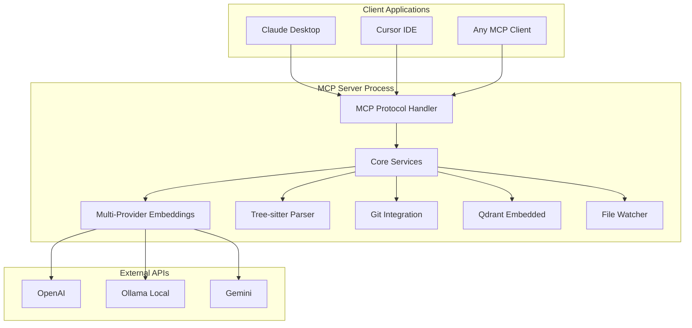

# MCP Semantic Code Indexing Server Implementation Roadmap
## From Roo Code to Production-Ready MCP Server

---

## Project Overview

**Objective**: Extract and adapt the proven Roo Code semantic indexing implementation into a standalone MCP server optimized for individual developers and OSS contributors.

**Timeline**: 7-10 weeks  
**Budget**: $70-100K  
**Success Probability**: 85%+  

## Technical Foundation

### Source Implementation: Roo Code
- **Advanced Tree-sitter parsing** for 20+ programming languages
- **Multi-provider embeddings** (OpenAI, Ollama, Gemini, OpenAI-compatible)
- **Enterprise-scale performance** (handles 100K+ files)
- **Sophisticated caching** with hash-based incremental processing
- **Git integration** with branch detection and file watching
- **Comprehensive error handling** and state management

### Target Architecture: MCP Server


## Implementation Phases

### Phase 1: Core Extraction & Dependency Removal (Weeks 1-3)

#### Week 1-2: Component Extraction
**Objective**: Extract core Roo Code components with minimal adaptation

**Direct Component Extraction**:
```
Source → Target Mapping:
/src/services/code-index/processors/parser.ts          → /src/parsers/tree-sitter.ts
/src/services/code-index/embedders/openai.ts           → /src/embedders/openai.ts
/src/services/code-index/embedders/ollama.ts           → /src/embedders/ollama.ts
/src/services/code-index/embedders/gemini.ts           → /src/embedders/gemini.ts
/src/services/code-index/embedders/openai-compatible.ts → /src/embedders/openai-compatible.ts
/src/services/code-index/processors/scanner.ts         → /src/core/scanner.ts
/src/services/code-index/cache-manager.ts              → /src/utils/cache.ts
/src/services/code-index/processors/file-watcher.ts    → /src/core/file-watcher.ts
```

**Tasks**:
- [ ] Extract Tree-sitter parsing with all language support
- [ ] Port all embedding provider implementations
- [ ] Preserve file scanning and filtering logic
- [ ] Maintain hash-based caching system
- [ ] Extract file watching and change detection

**Deliverable**: Core processing components isolated from VS Code

#### Week 3: VS Code Dependency Removal
**Objective**: Replace VS Code-specific dependencies with standalone alternatives

**Configuration System**:
- **Current**: VS Code Settings API (`vscode.workspace.getConfiguration`)
- **Target**: JSON configuration files with schema validation
- **Implementation**: Zod schemas for type-safe configuration

**File System Access**:
- **Current**: VS Code Workspace API (`vscode.workspace.fs`)
- **Target**: Node.js `fs` modules with proper error handling
- **Implementation**: `chokidar` for cross-platform file watching

**State Management**:
- **Current**: Extension global state, workspace state
- **Target**: Local file-based state storage and database persistence
- **Implementation**: SQLite for persistent state

**Tasks**:
- [ ] Create JSON configuration system with validation
- [ ] Replace VS Code file system APIs with Node.js equivalents
- [ ] Implement standalone state management
- [ ] Create logging system for console output
- [ ] Remove extension lifecycle dependencies

**Deliverable**: Standalone components with no VS Code dependencies

### Phase 2: Storage Layer & MCP Interface (Weeks 4-6)

#### Storage Technology Decision
**Recommended: Qdrant Embedded** (Weeks 4-5)

**Rationale**:
- **95% code reuse** from existing Roo Code implementation
- **Proven performance** characteristics already validated
- **Minimal adaptation** required vs complete rewrite
- **Lower technical risk** with known behavior

**Alternative Options**:
- **DuckDB + VSS**: Single binary, SQL familiarity (2-3 weeks)
- **Chroma**: Simple API, good for prototyping (2-3 weeks)

**Tasks for Qdrant Embedded**:
- [ ] Configure Qdrant for embedded deployment
- [ ] Adapt connection management for single-process mode
- [ ] Preserve existing query patterns and optimizations
- [ ] Test performance with representative codebases
- [ ] Create migration utilities if needed

#### MCP Protocol Implementation (Week 6)
**Objective**: Map existing Roo Code methods to MCP tools

**Core MCP Tools**:
```typescript
// Tool mapping from existing methods
CodeIndexManager.indexDirectory()     → index_codebase tool
SearchService.search()                → search_code tool
StateManager.getStatus()              → get_index_status tool
// New functionality
PatternMatcher.findSimilar()          → find_similar_code tool
```

**MCP Server Structure**:
```typescript
import { Server } from "@modelcontextprotocol/sdk/server/index.js";
import { StdioServerTransport } from "@modelcontextprotocol/sdk/server/stdio.js";

class SemanticCodeIndexingServer {
  private server: Server;
  private indexer: CodeIndexer;
  
  constructor() {
    this.server = new Server({
      name: "semantic-code-indexing",
      version: "1.0.0",
    }, {
      capabilities: { tools: {} }
    });
    this.setupTools();
  }
  
  private setupTools() {
    // index_codebase tool implementation
    // search_code tool implementation  
    // get_index_status tool implementation
    // find_similar_code tool implementation
  }
}
```

**Tasks**:
- [ ] Implement MCP protocol handler with TypeScript SDK
- [ ] Create tool parameter validation and response formatting
- [ ] Map existing error handling to MCP error responses
- [ ] Implement progress reporting through MCP responses
- [ ] Create comprehensive tool documentation

**Deliverable**: Working MCP server with all core tools

### Phase 3: Integration & Testing (Weeks 7-8)

#### Week 7: System Integration
**Objective**: End-to-end workflow validation and optimization

**Git Integration**:
- [ ] Implement repository detection using existing patterns
- [ ] Add branch switching support with index updates
- [ ] Create incremental file change processing
- [ ] Test with multiple repository types

**Performance Validation**:
- [ ] Benchmark with representative codebases:
  - Small personal projects (100-500 files)
  - Medium projects (500-2k files) 
  - Large OSS repositories (5k-20k files)
  - Enterprise-scale projects (20k-50k files)

**Target Performance**:
| Repository Size | Target Search Time | Memory Usage |
|----------------|-------------------|--------------|
| 100-500 files | <1s | 200-500MB |
| 500-2k files | <2s | 500MB-1GB |
| 5k-20k files | <5s | 1-2GB |
| 20k-50k files | <10s | 2-4GB |

#### Week 8: Cross-Platform Testing
**Objective**: Ensure compatibility across development environments

**Platform Testing**:
- [ ] macOS (primary development platform)
- [ ] Linux (Ubuntu, Debian, Arch)
- [ ] Windows (10, 11)

**MCP Client Testing**:
- [ ] Claude Desktop integration
- [ ] Cursor IDE compatibility
- [ ] Generic MCP client libraries

**Error Handling Validation**:
- [ ] Network connectivity issues
- [ ] File system permissions
- [ ] Configuration errors
- [ ] Resource exhaustion scenarios

**Deliverable**: Production-ready MCP server with validated performance

### Phase 4: Distribution & Documentation (Weeks 9-10)

#### Week 9: Distribution Preparation
**Objective**: Create deployment automation and packaging

**NPM Package**:
```json
{
  "name": "@semantic-indexing/mcp-server",
  "version": "1.0.0",
  "bin": {
    "semantic-indexing-mcp": "./dist/server.js"
  },
  "engines": {
    "node": ">=18.0.0"
  }
}
```

**Installation Methods**:
```bash
# NPM global installation
npm install -g @semantic-indexing/mcp-server

# Docker container
docker run -v /local/project:/workspace semantic-indexing/mcp-server

# Direct download
curl -sSL https://install.semantic-indexing.dev | bash
```

**Tasks**:
- [ ] Create NPM package with proper dependencies
- [ ] Build Docker container with embedded dependencies
- [ ] Create installation scripts for different platforms
- [ ] Set up automated testing pipeline
- [ ] Prepare distribution documentation

#### Week 10: Documentation & Examples
**Objective**: Comprehensive setup and usage documentation

**5-Minute Setup Guide**:
```markdown
# Quick Start
1. Install: `npm install -g @semantic-indexing/mcp-server`
2. Configure: `semantic-indexing-mcp setup`
3. Index: `semantic-indexing-mcp index ~/my-project`
4. Search: Configure MCP client and start searching
```

**Documentation Structure**:
- [ ] Quick start guide (5-minute setup)
- [ ] Configuration reference (all providers and options)
- [ ] Usage examples (common workflows)
- [ ] Troubleshooting guide (common issues and solutions)
- [ ] API reference (MCP tool specifications)
- [ ] Performance tuning guide

**Example Configurations**:
- [ ] Personal development setup
- [ ] OSS contribution workflow
- [ ] Privacy-focused configuration (Ollama)
- [ ] Cost-optimized setup

**Deliverable**: Complete documentation and ready-to-distribute package

## Configuration Design

### Personal-Scale Configuration
```typescript
interface PersonalConfig {
  // Embedding provider selection
  embedding: {
    provider: 'openai' | 'ollama' | 'gemini' | 'openai-compatible';
    apiKey?: string;              // For cloud providers
    baseUrl?: string;             // For local/custom providers
    model?: string;               // Provider-specific model
    costLimit?: {                 // Cost management
      daily: number;
      monthly: number;
    };
  };
  
  // Database and storage
  storage: {
    path?: string;                // Default: ~/.semantic-index/
    provider: 'qdrant-embedded';  // Extensible for future options
  };
  
  // Indexing preferences
  indexing: {
    autoIndex?: boolean;          // Auto-index on file changes
    excludePatterns?: string[];   // Additional exclude patterns
    maxFileSize?: number;         // Skip files larger than X MB
    languages?: string[];         // Limit to specific languages
  };
  
  // Performance tuning
  performance: {
    batchSize?: number;           // Files per batch
    concurrency?: number;         // Concurrent operations
    memoryLimit?: number;         // Memory usage limit
  };
}
```

### Configuration Templates
**Performance-Optimized**:
```json
{
  "embedding": {
    "provider": "openai",
    "model": "text-embedding-3-small",
    "costLimit": { "daily": 1.0, "monthly": 20.0 }
  },
  "performance": {
    "batchSize": 100,
    "concurrency": 8,
    "memoryLimit": 4096
  }
}
```

**Cost-Optimized**:
```json
{
  "embedding": {
    "provider": "ollama",
    "model": "nomic-embed-text",
    "baseUrl": "http://localhost:11434"
  },
  "performance": {
    "batchSize": 20,
    "concurrency": 2
  }
}
```

**Privacy-Focused**:
```json
{
  "embedding": {
    "provider": "ollama",
    "model": "nomic-embed-text"
  },
  "storage": {
    "path": "./local-index"
  },
  "indexing": {
    "excludePatterns": ["*.log", "*.tmp", ".env*"]
  }
}
```

## Risk Management & Contingency Plans

### High-Risk Scenarios & Mitigation

#### Storage Layer Performance Issues
**Risk**: Qdrant embedded doesn't match performance expectations
**Probability**: Medium  
**Impact**: High

**Contingency Plan**:
- **Immediate**: Performance profiling and optimization
- **Short-term**: Switch to DuckDB + VSS implementation
- **Long-term**: Hybrid approach with multiple storage backends

#### VS Code Dependencies More Complex Than Expected
**Risk**: Deeper integration requires significant refactoring
**Probability**: Medium  
**Impact**: Medium (timeline extension)

**Contingency Plan**:
- **Buffer**: Additional 1-2 weeks in timeline
- **Fallback**: Minimal abstraction layer instead of full replacement
- **Alternative**: Keep some VS Code concepts in initial release

#### MCP Protocol Integration Challenges
**Risk**: Tool interface mapping proves complex
**Probability**: Low  
**Impact**: Medium

**Contingency Plan**:
- **Simplified MVP**: Start with basic search tool only
- **Iterative**: Add tools incrementally based on complexity
- **Documentation**: Leverage extensive MCP SDK documentation

### Success Metrics & Checkpoints

#### Phase 1 Success Criteria
- [ ] All core components extracted without VS Code dependencies
- [ ] Tree-sitter parsing works identically to original
- [ ] Embedding providers maintain same API contracts
- [ ] File scanning produces identical results

#### Phase 2 Success Criteria
- [ ] Vector storage performs within 20% of original
- [ ] MCP tools respond correctly to all test scenarios
- [ ] Configuration system validates all options
- [ ] Error handling covers all major failure modes

#### Phase 3 Success Criteria
- [ ] End-to-end workflows complete successfully
- [ ] Performance meets targets for all repository sizes
- [ ] Cross-platform compatibility verified
- [ ] Memory usage stays within acceptable bounds

#### Phase 4 Success Criteria
- [ ] Installation completes in <5 minutes on all platforms
- [ ] Documentation enables successful setup for target users
- [ ] Package distribution works reliably
- [ ] User feedback indicates successful value delivery

## Resource Allocation

### Development Team Structure
- **Senior TypeScript Developer**: Full-time for 7-10 weeks
- **Vector Database Specialist**: Part-time consultation for Phase 2
- **Documentation Writer**: Part-time for Phase 4
- **QA/Testing**: Part-time throughout all phases

### Infrastructure Requirements
- **Development Environment**: Standard Node.js toolchain
- **Testing Infrastructure**: Multiple platform VMs/containers
- **Storage**: Test repositories and benchmark datasets
- **Distribution**: NPM registry, Docker Hub, GitHub releases

### Budget Breakdown
- **Development**: $60-80K (primary developer)
- **Consultation**: $5-10K (specialists)
- **Infrastructure**: $2-5K (testing and distribution)
- **Documentation**: $3-5K (technical writing)
- **Total**: $70-100K

## Success Definition & Metrics

### Technical Success
- **Search Quality**: >0.8 relevance score for semantic queries
- **Performance**: Meets all target response times
- **Reliability**: <5% error rate across all operations
- **Compatibility**: Works with major MCP clients

### Business Success
- **Adoption**: 500+ users in first 6 months
- **Community**: Active GitHub community with contributions
- **Feedback**: >4.5/5 rating from early adopters
- **Growth**: Clear path to sustainable development

### User Experience Success
- **Setup Time**: <5 minutes from install to first search
- **Learning Curve**: Minimal configuration required
- **Value Delivery**: Demonstrable improvement in code discovery
- **Integration**: Seamless MCP client workflow

## Next Steps

### Immediate Actions (Week 1)
1. **Dependency Audit**: Detailed analysis of Roo Code VS Code dependencies
2. **Repository Setup**: Create project structure and tooling
3. **Core Extraction**: Begin extracting Tree-sitter and embedding components
4. **MCP Prototype**: Basic MCP server with one simple tool

### Success Gates
- **Week 3**: Core components standalone and functional
- **Week 6**: MCP server with all tools responding correctly
- **Week 8**: Performance validated and cross-platform tested
- **Week 10**: Documentation complete and package ready for distribution

This roadmap provides a clear path from the proven Roo Code implementation to a production-ready MCP server that democratizes semantic code indexing for individual developers worldwide.

---

*Roadmap Version: 1.0*  
*Created: January 15, 2025*  
*Status: Ready for Implementation*  
*Next Milestone: Dependency Audit & Core Extraction*