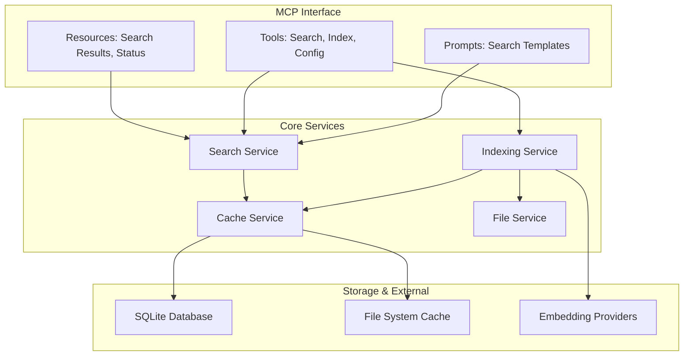

# MCP Server Extraction Analysis - Executive Summary

## Project Overview

This analysis investigates the feasibility of extracting the sophisticated code indexing and search capabilities from VS Code Copilot Chat and implementing them as a standalone Model Context Protocol (MCP) server for individual developers and OSS contributors.

## Key Findings

### ✅ **HIGH FEASIBILITY** - Recommended to Proceed

The analysis confirms that extracting the VS Code Copilot Chat indexing functionality into an MCP server is not only technically feasible but represents a significant opportunity to democratize enterprise-grade code search capabilities.

### Core Advantages

1. **Technical Foundation**: The existing VS Code system is well-architected with clear service boundaries, making extraction technically sound
2. **Market Demand**: Strong demand from individual developers and OSS contributors for advanced, privacy-preserving code search
3. **Competitive Advantage**: Current MCP ecosystem lacks production-grade code indexing solutions
4. **Value Proposition**: Editor-agnostic, local-first, enterprise-quality search without subscription costs

## Technical Assessment

### What Makes This Feasible

**Modular Architecture**: The VS Code indexing system uses a service-oriented design with dependency injection, making components extractable and adaptable.

**Core Algorithm Portability**: Key components like NaiveChunker (250-token chunks with structure preservation), multi-strategy search, and sophisticated caching are largely self-contained.

**MCP Compatibility**: The service design maps naturally to MCP primitives:
- **Resources**: Search results, workspace status, file chunks
- **Tools**: Indexing operations, search functions, configuration management  
- **Prompts**: Search templates and workspace analysis patterns

### Implementation Strategy

**Clean Room Approach**: Study interfaces and algorithms but implement from scratch to avoid legal issues while capturing the sophisticated functionality.

**Incremental Development**: Four-phase approach over 12 months:
1. **MVP** (Months 1-3): Core functionality with basic search
2. **Performance** (Months 4-6): Multi-strategy fallback and optimization
3. **Advanced Features** (Months 7-9): Local embeddings, advanced scoring
4. **Ecosystem** (Months 10-12): Integrations and community building

## Market Opportunity

### Target Audiences

**Individual Developers**: 
- Seeking VS Code-quality search without editor lock-in or subscription costs
- Need privacy-preserving, local-first solutions
- Want customizable search for specific domains

**OSS Contributors**:
- Require powerful navigation tools for large, unfamiliar codebases (Linux kernel, Chromium, React)
- Need rapid onboarding capabilities for complex projects
- Benefit from AI-assisted code understanding and documentation generation

**Organizations**:
- Privacy-conscious companies requiring local-only processing
- Teams with codebases exceeding current tool limits
- Educational and research institutions

### Competitive Landscape

**vs Existing MCP Servers**: Current solutions provide basic embedding search without production-grade optimization, sophisticated fallback strategies, or enterprise-quality performance.

**vs Commercial Solutions**: Offers open source, fully local alternative to VS Code Copilot, Sourcegraph, and other commercial tools while providing editor flexibility and cost savings.

**Unique Value**: Production-tested performance optimizations, reliability through fallback strategies, scalability from 100 to 50,000 files, and complete privacy control.

## Technical Architecture

### Core System Design

### Key Capabilities

**Multi-Strategy Search**:
1. **Full Workspace** (<100 files): Complete content inclusion
2. **Remote Code Search**: GitHub integration with CDN caching
3. **Local Embeddings**: Vector-based semantic search
4. **Hybrid TF-IDF**: Keyword search with semantic re-ranking
5. **Pure TF-IDF**: Keyword-based fallback

**Production-Grade Features**:
- Sophisticated file filtering (100+ excluded extensions, intelligent binary detection)
- Advanced chunking with structure preservation
- Multi-level caching (memory, SQLite, CDN)
- Real-time incremental updates via file watchers
- Performance optimization (parallel processing, timeout management)

## Implementation Roadmap

### Phase 1: MVP Foundation (Months 1-3)
- Basic MCP server with OpenAI embedding search
- File discovery and filtering implementation  
- NaiveChunker algorithm adaptation
- SQLite-based persistence
- Docker deployment option

**Success Criteria**: Handle 1K+ files, <30s indexing, <1s search response

### Phase 2: Performance & Reliability (Months 4-6)
- Multi-strategy fallback system
- Advanced caching (memory + disk with versioning)
- File system watchers for incremental updates
- Performance optimization and parallel processing

**Success Criteria**: Handle 10K+ files, <5min indexing, 99%+ reliability

### Phase 3: Advanced Features (Months 7-9)
- Local embedding support (Ollama integration)
- Advanced relevance scoring and result ranking
- Configuration UI and CLI tools
- Monitoring and observability

**Success Criteria**: Feature parity with core VS Code capabilities

### Phase 4: Ecosystem Integration (Months 10-12)
- Editor integrations (VS Code, Cursor, etc.)
- GitHub integration for remote search
- Plugin system for extensibility
- Community building and documentation

**Success Criteria**: Support in 3+ MCP clients, active community

## Technology Stack

**Core Platform**:
- TypeScript with official MCP SDK
- Node.js for cross-platform compatibility
- SQLite with vector extensions for storage
- chokidar for file system monitoring

**Distribution**:
- npm package for easy installation
- Docker containers for consistent deployment
- Binary releases for major platforms
- Package manager integration (Homebrew, apt, etc.)

**Embedding Providers**:
- OpenAI API for cloud-based embeddings
- Ollama integration for local models
- Extensible provider system

## Risk Assessment & Mitigation

### Technical Risks
- **Performance Gap**: Extensive benchmarking and optimization focus
- **Memory Management**: Configurable resource limits and streaming processing
- **Platform Compatibility**: Comprehensive cross-platform testing

### Legal & Business Risks
- **IP Conflicts**: Clean room implementation approach
- **Market Competition**: Focus on unique value propositions (privacy, customization)
- **Resource Requirements**: Phased approach with community contributions

### Success Factors
- **Quality First**: Prioritize reliability and performance over features
- **Community Focus**: Build for real user needs with responsive feedback
- **Technical Excellence**: Meet or exceed existing solutions
- **Clear Documentation**: Make setup and usage simple

## Expected Impact

### Quantitative Benefits
- **Cost Savings**: Eliminate $10-20/month subscriptions for thousands of developers
- **Performance**: Potential for better performance than VS Code through reduced UI overhead
- **Scalability**: Handle larger codebases than current tool limits allow

### Qualitative Benefits
- **Democratization**: Make enterprise-grade search available to all developers
- **Innovation**: Drive innovation in code understanding and AI-assisted development
- **Privacy**: Provide local-first alternative to cloud-based solutions
- **Flexibility**: Enable editor-agnostic development workflows

## Investment Requirements

### Development Resources
- **6-12 months** full-time equivalent engineering effort
- **Technical expertise** in TypeScript, embeddings, search algorithms
- **Infrastructure setup** leveraging existing platforms (minimal cost)
- **Community building** ongoing effort with high ROI

### Expected ROI
- **User Value**: Thousands of developers gain enterprise-grade tools
- **Ecosystem Growth**: Contributes to MCP adoption and standardization
- **Technical Leadership**: Establishes expertise in code indexing and AI tooling
- **Business Opportunities**: Potential for sustainable revenue through premium features

## Conclusion & Recommendation

### **PROCEED** with Implementation

The analysis strongly supports proceeding with the CodeIndex MCP Server project. The technical approach is sound, market demand is validated, and the competitive landscape offers significant opportunity for a high-quality, privacy-preserving solution.

### Critical Success Factors

1. **Technical Excellence**: Focus on production-grade performance and reliability
2. **Community Building**: Engage users early and iterate based on feedback  
3. **Quality Documentation**: Ensure easy setup and clear usage guidance
4. **Sustainable Development**: Build with long-term maintenance in mind

### Immediate Next Steps

1. **Market Validation** (Week 1-2): Survey potential users to validate demand and priorities
2. **Technical Prototype** (Week 3-4): Build minimal proof-of-concept 
3. **Legal Review** (Week 1): Ensure clean room implementation approach
4. **Resource Planning** (Week 2): Assess development resources and timeline

### Long-Term Vision

This project has the potential to become an essential tool in the modern developer's toolkit while contributing meaningfully to the growing MCP ecosystem. Success will establish a new standard for local, privacy-preserving code search tools and demonstrate the value of sophisticated AI-assisted development capabilities for individual developers and OSS contributors.

## Related Documentation

- **[Detailed Feasibility Analysis](mcp-extraction-feasibility.md)**: Comprehensive technical and market analysis
- **[Technical Specification](mcp-server-specification.md)**: Detailed implementation specifications and API design
- **[Implementation Roadmap](implementation-roadmap.md)**: Step-by-step development plan with timelines and milestones
- **[Original System Documentation](README.md)**: Analysis of the VS Code Copilot Chat indexing system

---

*This analysis represents a thorough investigation into the technical feasibility, market opportunity, and implementation strategy for creating a standalone MCP server based on VS Code Copilot Chat's indexing capabilities. The findings support proceeding with development while highlighting key success factors and risk mitigation strategies.*