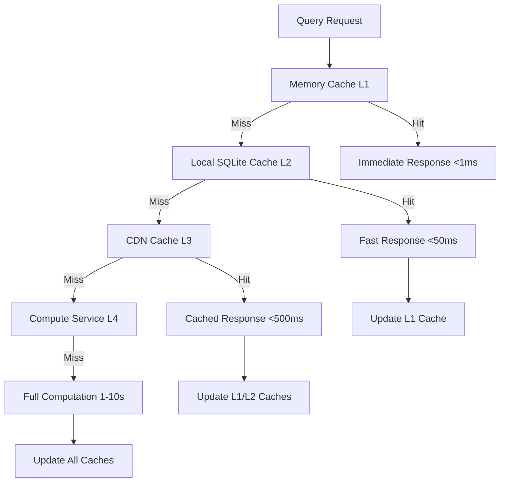

# Performance Documentation

## Overview

The VS Code Copilot Chat indexing system is designed for high performance across diverse workspace configurations, from small personal projects to large enterprise codebases. This document details the comprehensive performance optimization strategies, caching mechanisms, and scalability considerations.

## Multi-Level Caching Architecture

### Cache Hierarchy



### Level 1: Memory Cache (LRU)

**Location**: In-memory caching throughout the application

**Characteristics**:
- **Access Time**: <1ms
- **Capacity**: 1000-5000 items typical
- **Eviction Policy**: Least Recently Used (LRU)
- **Scope**: Single session, per-process
- **Contents**: Embeddings, query results, chunk metadata

**Implementation Example**:
```typescript
class EmbeddingCache {
    private readonly cache = new Map<string, Embedding>();
    private readonly maxSize = 5000;
    
    get(key: string): Embedding | undefined {
        const value = this.cache.get(key);
        if (value) {
            // LRU: Move to end
            this.cache.delete(key);
            this.cache.set(key, value);
        }
        return value;
    }
    
    set(key: string, value: Embedding): void {
        if (this.cache.size >= this.maxSize) {
            // Remove oldest item
            const firstKey = this.cache.keys().next().value;
            this.cache.delete(firstKey);
        }
        this.cache.set(key, value);
    }
}
```

### Level 2: Local SQLite Cache

**Location**: `src/platform/workspaceChunkSearch/node/workspaceChunkEmbeddingsIndex.ts`

**Characteristics**:
- **Access Time**: 10-50ms
- **Capacity**: Limited by disk space (typically GBs)
- **Persistence**: Survives application restarts
- **Scope**: Per workspace
- **Contents**: Embeddings, TF-IDF indexes, chunk data

**Schema Example**:
```sql
-- Embeddings table
CREATE TABLE embeddings (
    id INTEGER PRIMARY KEY,
    chunk_hash TEXT UNIQUE,
    embedding_type TEXT,
    embedding_data BLOB,
    created_time INTEGER,
    file_uri TEXT,
    chunk_range TEXT
);

-- Index for fast lookups
CREATE INDEX idx_embeddings_hash ON embeddings(chunk_hash);
CREATE INDEX idx_embeddings_file ON embeddings(file_uri);
```

**Performance Optimizations**:
- **Batch Insertions**: Use transactions for bulk operations
- **Prepared Statements**: Avoid SQL parsing overhead
- **Connection Pooling**: Reuse database connections
- **WAL Mode**: Write-Ahead Logging for better concurrency

### Level 3: CDN Cache

**Location**: GitHub's CDN infrastructure

**Characteristics**:
- **Access Time**: 100-500ms
- **Capacity**: Virtually unlimited
- **Scope**: Global, shared across users
- **Contents**: Pre-computed embeddings for popular repositories
- **Availability**: Requires network connectivity

**Cache Strategy**:
- **Repository-Based**: Cache organized by repository and commit hash
- **Version Management**: Automatic invalidation on new commits
- **Geographic Distribution**: Edge locations for low latency
- **Compression**: Efficient storage and transfer

### Level 4: Compute Services

**Location**: External embedding and search services

**Characteristics**:
- **Processing Time**: 1-10 seconds
- **Capacity**: Scalable cloud infrastructure
- **Scope**: On-demand computation
- **Fallback**: Local computation when unavailable

## Performance Optimization Strategies

### Parallel Processing

#### Concurrent File Processing

**Location**: `src/platform/workspaceChunkSearch/node/workspaceFileIndex.ts`

```typescript
class WorkspaceFileIndex {
    private readonly processingLimiter = new Limiter(10); // Max 10 concurrent
    
    async processFiles(files: URI[]): Promise<FileChunk[]> {
        const chunks: FileChunk[] = [];
        
        await Promise.all(
            files.map(file => 
                this.processingLimiter.queue(() => this.processFile(file))
            )
        );
        
        return chunks.flat();
    }
}
```

**Benefits**:
- **CPU Utilization**: Use multiple cores effectively
- **I/O Parallelism**: Overlap file reading with processing
- **Resource Control**: Limit concurrent operations to prevent overload
- **Throughput**: Process 100-500 files per second

#### Strategy Racing

**Location**: `src/platform/workspaceChunkSearch/node/workspaceChunkSearchService.ts:513-563`

```typescript
private async raceSearchOperations(
    ops: readonly CancelablePromise<StrategySearchOutcome>[]
): Promise<StrategySearchOutcome> {
    // Cancel slower operations when fast one completes
    for (const op of ops) {
        op.then(result => {
            if (result.isOk()) {
                ops.forEach(otherOp => otherOp.cancel());
            }
        }, () => { });
    }
    
    const results = await Promise.allSettled(ops);
    return this.selectBestResult(results);
}
```

**Racing Benefits**:
- **Optimal Performance**: Always use fastest available strategy
- **Resource Efficiency**: Cancel unnecessary computation
- **Reliability**: Multiple strategies provide redundancy
- **User Experience**: Results appear as soon as possible

### Memory Management

#### Bounded Resource Usage

**Configuration Limits**:
```typescript
const MEMORY_LIMITS = {
    maxConcurrentFiles: 50,
    maxChunkCacheSize: 10_000,
    maxEmbeddingCacheSize: 5_000,
    maxFileSize: 1.5 * 1024 * 1024, // 1.5MB
    chunkSize: 250, // tokens
};
```

#### Streaming Architecture

**Location**: `src/platform/chunking/node/naiveChunker.ts:57-115`

```typescript
private async *_processLinesIntoChunks(
    uri: URI,
    text: string,
    maxTokenLength: number,
    // ... other parameters
): AsyncIterable<FileChunk> {
    // Process file line by line, yielding chunks incrementally
    const lines = splitLines(text);
    let currentChunk: IChunkedLine[] = [];
    
    for (const line of lines) {
        // Process line and yield chunk when complete
        if (shouldEmitChunk(currentChunk, line)) {
            yield this.finalizeChunk(currentChunk);
            currentChunk = [];
        }
        currentChunk.push(processLine(line));
    }
    
    if (currentChunk.length > 0) {
        yield this.finalizeChunk(currentChunk);
    }
}
```

**Streaming Benefits**:
- **Memory Efficiency**: Process large files without loading entirely
- **Responsive UI**: Yield control during long operations
- **Cancellation Support**: Can stop processing mid-stream
- **Scalability**: Handle arbitrarily large workspaces

### Query Optimization

#### Parallel Embedding Resolution

**Location**: `src/platform/workspaceChunkSearch/node/workspaceChunkSearchService.ts:426-441`

```typescript
private toQueryWithEmbeddings(
    query: WorkspaceChunkQuery, 
    token: CancellationToken
): WorkspaceChunkQueryWithEmbeddings {
    // Start embedding computation immediately, in parallel with strategy selection
    const queryEmbeddings: Promise<Embedding> = logExecTime(
        this._logService, 
        'WorkspaceChunkSearch.resolveQueryEmbeddings', 
        () => query.resolveQuery(token).then(async (queryStr) => {
            const result = await this.computeEmbeddings('query', [queryStr], token);
            const first = result.values.at(0);
            if (!first) {
                throw new Error('Could not resolve query embeddings');
            }
            return first;
        })
    );
    
    return {
        ...query,
        resolveQueryEmbeddings: (_token) => queryEmbeddings
    };
}
```

**Optimization Benefits**:
- **Latency Reduction**: Embedding computation starts immediately
- **Pipeline Efficiency**: Overlap computation with strategy selection
- **Resource Utilization**: Keep embedding service busy
- **User Experience**: Faster time to results

#### Result Batching

**Location**: `src/platform/workspaceChunkSearch/node/workspaceChunkSearchService.ts:742-781`

```typescript
private async scoreChunks<T extends FileChunk>(
    query: WorkspaceChunkQueryWithEmbeddings,
    chunks: readonly T[],
    telemetryInfo: TelemetryCorrelationId,
    token: CancellationToken,
): Promise<ScoredFileChunk<T>[]> {
    if (!chunks.length) return [];
    
    const chunkStrings = chunks.map(chunk => this.chunkToIndexString(chunk));
    
    // Batch embedding computation for efficiency
    const [queryEmbeddings, chunkEmbeddings] = await Promise.all([
        query.resolveQueryEmbeddings(token),
        this.computeEmbeddings('document', chunkStrings, token)
    ]);
    
    // Compute all distances in single batch
    return chunkEmbeddings.values.map((embedding, index): ScoredFileChunk<T> => ({
        chunk: chunks[index],
        distance: distance(queryEmbeddings, embedding),
    }));
}
```

## Caching Strategies

### Cache Coherency

#### File Change Detection

**Location**: `src/platform/workspaceChunkSearch/node/workspaceFileIndex.ts`

```typescript
class FileChangeTracker {
    private readonly fileWatchers = new Map<string, vscode.FileSystemWatcher>();
    private readonly changeDebouncer = new Map<string, NodeJS.Timeout>();
    
    watchFile(uri: URI): void {
        const watcher = vscode.workspace.createFileSystemWatcher(
            new vscode.RelativePattern(uri, '**/*')
        );
        
        watcher.onDidChange(uri => this.handleFileChange(uri));
        watcher.onDidCreate(uri => this.handleFileCreate(uri));
        watcher.onDidDelete(uri => this.handleFileDelete(uri));
        
        this.fileWatchers.set(uri.toString(), watcher);
    }
    
    private handleFileChange(uri: URI): void {
        // Debounce rapid changes
        const key = uri.toString();
        if (this.changeDebouncer.has(key)) {
            clearTimeout(this.changeDebouncer.get(key)!);
        }
        
        this.changeDebouncer.set(key, setTimeout(() => {
            this.invalidateCache(uri);
            this.reindexFile(uri);
            this.changeDebouncer.delete(key);
        }, 60_000)); // 60 second debounce
    }
}
```

#### Incremental Updates

**Features**:
- **Selective Invalidation**: Only affected chunks are removed from cache
- **Delta Processing**: Only changed portions of files are re-processed
- **Dependency Tracking**: Understand which cached items depend on changed files
- **Atomic Updates**: Ensure cache consistency during updates

#### Cache Warming

**Location**: `src/platform/workspaceChunkSearch/node/workspaceChunkSearchService.ts:261-274`

```typescript
// Automatic background indexing on first search
if (this._extensionContext.workspaceState.get(this.shouldEagerlyIndexKey, false)) {
    this._codeSearchChunkSearch.isAvailable().then(async hasCodeSearch => {
        if (!hasCodeSearch && !this._isDisposed) {
            try {
                // Warm up local embeddings cache in background
                await this._embeddingsChunkSearch.triggerLocalIndexing('auto');
            } catch {
                // Silent failure for background operations
            }
        }
    });
}
```

### Cache Invalidation

#### Version-Based Invalidation

```typescript
interface CachedEmbedding {
    embedding: Embedding;
    modelVersion: string;
    fileHash: string;
    createdAt: Date;
}

class EmbeddingCacheManager {
    async validateCacheEntry(entry: CachedEmbedding): Promise<boolean> {
        // Check model version compatibility
        if (entry.modelVersion !== this.currentModelVersion) {
            return false;
        }
        
        // Check file modification
        const currentHash = await this.computeFileHash(entry.fileUri);
        if (currentHash !== entry.fileHash) {
            return false;
        }
        
        return true;
    }
}
```

#### Time-Based Expiration

```typescript
const CACHE_TTL = {
    embeddings: 7 * 24 * 60 * 60 * 1000,     // 7 days
    queries: 60 * 60 * 1000,                  // 1 hour
    fileMetadata: 24 * 60 * 60 * 1000,        // 24 hours
    searchResults: 10 * 60 * 1000,            // 10 minutes
};
```

## Performance Monitoring

### Telemetry and Metrics

**Location**: `src/platform/workspaceChunkSearch/node/workspaceChunkSearchService.ts:364-423`

```typescript
// Strategy performance tracking
this._telemetryService.sendMSFTTelemetryEvent('workspaceChunkSearchStrategy', {
    strategy: searchResult.isOk() ? searchResult.val.strategy : 'none',
    errorDiagMessage: searchResult.isError() ? searchResult.err.errorDiagMessage : undefined,
    workspaceSearchSource: telemetryInfo.callTracker.toString(),
    workspaceSearchCorrelationId: telemetryInfo.correlationId,
}, {
    execTime: searchSw.elapsed(),
    workspaceIndexFileCount: this._workspaceFileIndex.fileCount,
    wasFirstSearchInWorkspace: wasFirstSearchInWorkspace ? 1 : 0,
});

// Re-ranking performance tracking
this._telemetryService.sendMSFTTelemetryEvent('workspaceChunkSearch.perf.adaRerank', {
    status,
    workspaceSearchSource: telemetryInfo.callTracker,
    workspaceSearchCorrelationId: telemetryInfo.correlationId,
}, { execTime });
```

### Performance Benchmarks

| Operation | Target Time | Actual Range | Optimization |
|-----------|-------------|--------------|--------------|
| File Discovery | <1s | 100ms-2s | Parallel scanning |
| Chunking | <5s | 1s-10s | Streaming processing |
| Embedding Generation | <30s | 5s-60s | Batch computation |
| Query Processing | <2s | 100ms-5s | Cache utilization |
| Re-ranking | <1s | 200ms-3s | Selective re-computation |

### Memory Profiling

```typescript
class MemoryProfiler {
    private readonly samples: MemoryUsage[] = [];
    
    recordMemoryUsage(operation: string): void {
        const usage = process.memoryUsage();
        this.samples.push({
            operation,
            timestamp: Date.now(),
            heapUsed: usage.heapUsed,
            heapTotal: usage.heapTotal,
            external: usage.external,
            rss: usage.rss
        });
        
        // Alert on high memory usage
        if (usage.heapUsed > 512 * 1024 * 1024) { // 512MB
            this.logger.warn(`High memory usage detected: ${usage.heapUsed / 1024 / 1024}MB`);
        }
    }
}
```

## Scalability Considerations

### Workspace Size Scaling

| Workspace Size | Strategy | Memory Usage | Index Time | Query Time |
|----------------|----------|--------------|------------|------------|
| <100 files | Full Workspace | 10-50MB | 0s | <100ms |
| 100-1K files | Embeddings | 50-200MB | 30s-5min | 100ms-1s |
| 1K-10K files | Hybrid | 100-500MB | 2min-30min | 200ms-2s |
| 10K-25K files | TF-IDF | 200MB-1GB | 5min-60min | 50ms-500ms |
| >25K files | External/Chunked | 500MB-2GB | Variable | 500ms-5s |

### Resource Adaptation

#### Dynamic Limits

```typescript
class ResourceManager {
    getProcessingLimits(): ProcessingLimits {
        const totalMemory = os.totalmem();
        const availableMemory = totalMemory - (process.memoryUsage().heapUsed);
        
        return {
            maxConcurrentFiles: Math.min(50, Math.floor(availableMemory / (10 * 1024 * 1024))),
            maxChunkCacheSize: Math.floor(availableMemory / (1024 * 1024)) * 100,
            processingBatchSize: availableMemory > 1024 * 1024 * 1024 ? 100 : 50,
        };
    }
}
```

#### Progressive Enhancement

```typescript
class IndexingStrategy {
    selectStrategy(workspaceInfo: WorkspaceInfo): SearchStrategy {
        if (workspaceInfo.fileCount < 100) {
            return new FullWorkspaceStrategy();
        }
        
        if (workspaceInfo.hasGitHubRemote && this.hasAuthentication()) {
            return new CodeSearchStrategy();
        }
        
        if (workspaceInfo.fileCount < 2500 || this.hasHighMemory()) {
            return new EmbeddingsStrategy();
        }
        
        return new TfIdfStrategy();
    }
}
```

### Network Optimization

#### Request Batching

```typescript
class EmbeddingBatchProcessor {
    private readonly pendingRequests: EmbeddingRequest[] = [];
    private batchTimer?: NodeJS.Timeout;
    
    async requestEmbedding(text: string): Promise<Embedding> {
        return new Promise((resolve, reject) => {
            this.pendingRequests.push({ text, resolve, reject });
            
            if (!this.batchTimer) {
                this.batchTimer = setTimeout(() => this.processBatch(), 50);
            }
        });
    }
    
    private async processBatch(): Promise<void> {
        const batch = this.pendingRequests.splice(0);
        this.batchTimer = undefined;
        
        try {
            const embeddings = await this.computeBatchEmbeddings(
                batch.map(req => req.text)
            );
            
            batch.forEach((req, index) => {
                req.resolve(embeddings[index]);
            });
        } catch (error) {
            batch.forEach(req => req.reject(error));
        }
    }
}
```

#### Connection Pooling

```typescript
class HTTPConnectionPool {
    private readonly pools = new Map<string, HTTPConnection[]>();
    private readonly maxConnectionsPerHost = 10;
    
    async getConnection(host: string): Promise<HTTPConnection> {
        let pool = this.pools.get(host);
        if (!pool) {
            pool = [];
            this.pools.set(host, pool);
        }
        
        // Reuse existing connection if available
        const available = pool.find(conn => !conn.busy);
        if (available) {
            return available;
        }
        
        // Create new connection if under limit
        if (pool.length < this.maxConnectionsPerHost) {
            const newConnection = new HTTPConnection(host);
            pool.push(newConnection);
            return newConnection;
        }
        
        // Wait for connection to become available
        return this.waitForConnection(pool);
    }
}
```

## Performance Debugging

### Diagnostic Tools

#### Performance Logger

```typescript
class PerformanceLogger {
    private readonly operations = new Map<string, OperationMetrics>();
    
    @LogExecTime(self => self._logService, 'operation')
    async timedOperation<T>(name: string, operation: () => Promise<T>): Promise<T> {
        const start = performance.now();
        
        try {
            const result = await operation();
            this.recordSuccess(name, performance.now() - start);
            return result;
        } catch (error) {
            this.recordError(name, performance.now() - start, error);
            throw error;
        }
    }
}
```

#### Cache Hit Rate Monitoring

```typescript
class CacheMetrics {
    private readonly stats = {
        l1: { hits: 0, misses: 0 },
        l2: { hits: 0, misses: 0 },
        l3: { hits: 0, misses: 0 },
    };
    
    recordCacheAccess(level: 'l1' | 'l2' | 'l3', hit: boolean): void {
        if (hit) {
            this.stats[level].hits++;
        } else {
            this.stats[level].misses++;
        }
    }
    
    getHitRate(level: 'l1' | 'l2' | 'l3'): number {
        const { hits, misses } = this.stats[level];
        return hits / (hits + misses);
    }
}
```

### Common Performance Issues

#### High Memory Usage

**Symptoms**:
- Slow response times
- System lag
- Out of memory errors

**Debugging**:
```typescript
// Monitor memory usage during operations
const memBefore = process.memoryUsage();
await expensiveOperation();
const memAfter = process.memoryUsage();

console.log(`Memory delta: ${(memAfter.heapUsed - memBefore.heapUsed) / 1024 / 1024}MB`);
```

**Solutions**:
- Implement streaming processing
- Add memory pressure detection
- Reduce cache sizes
- Increase garbage collection frequency

#### Slow Query Performance

**Symptoms**:
- Search takes >5 seconds
- Timeout errors
- Poor result quality

**Debugging**:
```typescript
// Profile query stages
const stages = {
    embedding: await timeOperation(() => generateEmbedding(query)),
    search: await timeOperation(() => searchIndex(embedding)),
    rerank: await timeOperation(() => rerankResults(results)),
};

console.log('Query performance breakdown:', stages);
```

**Solutions**:
- Optimize embedding generation
- Improve index structure
- Reduce re-ranking complexity
- Use faster search strategies

This comprehensive performance system ensures the indexing functionality scales efficiently from small personal projects to large enterprise codebases while maintaining responsive user experience across all scenarios.