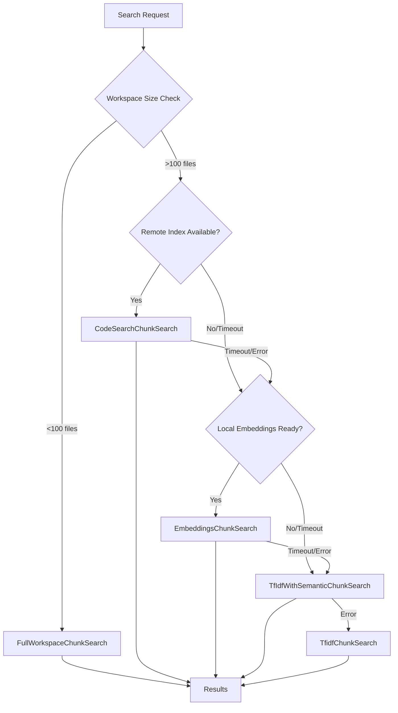

# Search Strategies Documentation

## Overview

The VS Code Copilot Chat indexing system implements a sophisticated hierarchy of search strategies, each optimized for different workspace characteristics and availability of resources. The strategies are designed with a fallback pattern that ensures reliable search functionality across all scenarios.

## Strategy Hierarchy

The search strategies are executed in a specific order, with each strategy serving as a fallback for the previous one:



## Strategy Implementation Details

### 1. FullWorkspaceChunkSearch

**Location**: `src/platform/workspaceChunkSearch/node/fullWorkspaceChunkSearch.ts`

**Purpose**: For small workspaces, include the entire workspace content without search processing.

#### Strategy Logic

```typescript
export class FullWorkspaceChunkSearch implements IWorkspaceChunkSearchStrategy {
    readonly id = WorkspaceChunkSearchStrategyId.FullWorkspace;
    
    async mayBeAvailable(sizing: StrategySearchSizing): Promise<boolean> {
        const fileCount = await this.getWorkspaceFileCount();
        return fileCount <= 100 && this.fitsInTokenBudget(sizing);
    }
}
```

#### Characteristics

- **File Limit**: Maximum 100 files in workspace
- **Processing**: No chunking or indexing required
- **Latency**: Near-zero search time
- **Quality**: Perfect recall (all content included)
- **Token Budget**: Must fit within context window

#### Use Cases

- **Small Projects**: Personal projects, scripts, configuration repos
- **Prototyping**: Early-stage development with minimal files
- **Documentation**: README-heavy repositories
- **Learning**: Educational repositories and tutorials

#### Advantages

- **Zero Latency**: Immediate results without computation
- **Perfect Context**: AI has access to complete workspace
- **No Indexing**: No setup or maintenance required
- **Complete Accuracy**: No search relevance issues

#### Limitations

- **Size Constraints**: Only works for very small workspaces
- **Token Usage**: Consumes significant context window space
- **No Filtering**: Cannot exclude irrelevant content

### 2. CodeSearchChunkSearch

**Location**: `src/platform/workspaceChunkSearch/node/codeSearchChunkSearch.ts`

**Purpose**: Leverage GitHub's remote indexing infrastructure for fast, high-quality search.

#### Architecture

```typescript
export class CodeSearchChunkSearch implements IWorkspaceChunkSearchStrategy {
    readonly id = WorkspaceChunkSearchStrategyId.CodeSearch;
    
    constructor(
        private readonly _embeddingType: EmbeddingType,
        private readonly _embeddingsChunkSearch: EmbeddingsChunkSearch,
        private readonly _tfIdfWithSemanticChunkSearch: TfIdfWithSemanticChunkSearch,
    ) {}
}
```

#### Remote Integration

**Features**:
- **Server-Side Indexing**: Computation happens on GitHub infrastructure
- **CDN Caching**: Pre-computed results cached globally
- **Repository Detection**: Automatic GitHub repository identification
- **Authentication**: OAuth-based access control

#### Performance Characteristics

- **Timeout**: 12.5 seconds maximum
- **Latency**: Typically 200-2000ms for cached results
- **Throughput**: High concurrent query support
- **Availability**: Requires network connectivity

#### Repository State Management

```typescript
export interface CodeSearchRemoteIndexState {
    readonly status: 'disabled' | 'loading' | 'loaded';
    readonly repos: readonly RepoIndexInfo[];
}

export interface RepoIndexInfo {
    readonly repoId: string;
    readonly status: RepoStatus;
    readonly lastIndexTime?: Date;
}

export enum RepoStatus {
    Unknown = 'unknown',
    Indexing = 'indexing', 
    Ready = 'ready',
    Failed = 'failed'
}
```

#### Trigger Mechanisms

**Automatic Triggers**:
- First search in workspace
- Authentication upgrade events
- Repository detection changes

**Manual Triggers**:
- User-initiated indexing commands
- Workspace configuration changes

#### Error Handling

- **Network Timeouts**: Graceful fallback to local strategies
- **Authentication Failures**: Clear error messaging and retry flows
- **Rate Limiting**: Respect API quotas with backoff
- **Repository Access**: Handle private repository permissions

### 3. EmbeddingsChunkSearch

**Location**: `src/platform/workspaceChunkSearch/node/embeddingsChunkSearch.ts`

**Purpose**: Semantic search using locally computed vector embeddings.

#### Index Management

```typescript
export interface LocalEmbeddingsIndexState {
    readonly status: LocalEmbeddingsIndexStatus;
    readonly getState: () => Promise<EmbeddingsIndexDetails | undefined>;
}

export enum LocalEmbeddingsIndexStatus {
    Unknown = 'unknown',
    Ready = 'ready',
    UpdatingIndex = 'updating', 
    RequiresIndexing = 'requiresIndexing'
}
```

#### Indexing Limits

| Configuration | Standard | Expanded |
|---------------|----------|----------|
| Automatic Indexing | 750 files | 50,000 files |
| Manual Indexing | 2,500 files | 50,000 files |
| Background Updates | Yes | Yes |
| Incremental Updates | Yes | Yes |

#### Processing Pipeline

1. **File Discovery**: Identify indexable files in workspace
2. **Chunking**: Break files into 250-token chunks
3. **Embedding Generation**: Compute vector embeddings for each chunk
4. **Index Storage**: Persist embeddings in local cache
5. **Query Processing**: Generate query embeddings and compute similarities

#### Search Algorithm

**Location**: `src/platform/workspaceChunkSearch/node/embeddingsChunkSearch.ts`

```typescript
async searchWorkspace(
    sizing: StrategySearchSizing,
    query: WorkspaceChunkQueryWithEmbeddings, 
    options: WorkspaceChunkSearchOptions,
    telemetryInfo: TelemetryCorrelationId,
    token: CancellationToken
): Promise<StrategySearchResult | undefined> {
    // 1. Resolve query embeddings
    const queryEmbedding = await query.resolveQueryEmbeddings(token);
    
    // 2. Search embedding index
    const searchResults = await this._embeddingsIndex.searchEmbeddings(
        queryEmbedding, 
        sizing.maxResultCountHint,
        token
    );
    
    // 3. Convert to ranked chunks
    return this.convertToChunkResults(searchResults, sizing);
}
```

#### Performance Characteristics

- **Timeout**: 8 seconds maximum
- **Indexing Speed**: 50-100 files per second
- **Query Speed**: 100-500ms typical
- **Memory Usage**: ~10MB per 1000 files
- **Disk Usage**: ~5MB per 1000 files

#### Quality Features

- **Semantic Understanding**: Captures meaning beyond keywords
- **Multi-language Support**: Works across programming languages
- **Context Awareness**: Understands code relationships
- **Relevance Ranking**: Cosine similarity scoring

### 4. TfIdfWithSemanticChunkSearch

**Location**: `src/platform/workspaceChunkSearch/node/tfidfWithSemanticChunkSearch.ts`

**Purpose**: Hybrid approach combining fast keyword search with semantic re-ranking.

#### Hybrid Architecture

```typescript
export class TfIdfWithSemanticChunkSearch implements IWorkspaceChunkSearchStrategy {
    readonly id = WorkspaceChunkSearchStrategyId.TfIdfWithSemantic;
    
    constructor(
        private readonly _tfidfChunkSearch: TfidfChunkSearch,
        private readonly _embeddingsIndex: WorkspaceChunkEmbeddingsIndex
    ) {}
}
```

#### Two-Stage Process

**Stage 1: TF-IDF Search**
1. **Keyword Extraction**: Extract terms from query
2. **TF-IDF Matching**: Fast SQLite-based keyword search
3. **Initial Ranking**: Score results by term frequency and document frequency
4. **Candidate Selection**: Select top N candidates for re-ranking

**Stage 2: Semantic Re-ranking**
1. **Embedding Generation**: Compute embeddings for query and candidates
2. **Similarity Computation**: Calculate cosine similarity scores
3. **Score Fusion**: Combine TF-IDF and embedding scores
4. **Final Ranking**: Re-order results by combined relevance

#### Algorithm Implementation

```typescript
async searchWorkspace(
    sizing: StrategySearchSizing,
    query: WorkspaceChunkQueryWithEmbeddings,
    options: WorkspaceChunkSearchOptions,
    telemetryInfo: TelemetryCorrelationId,
    token: CancellationToken
): Promise<StrategySearchResult | undefined> {
    // Get initial TF-IDF results
    const tfidfResults = await this._tfidfChunkSearch.searchWorkspace(
        sizing, query, options, telemetryInfo, token
    );
    
    if (!tfidfResults?.chunks.length) {
        return tfidfResults;
    }
    
    // Re-rank using embeddings
    return this.reRankWithEmbeddings(
        tfidfResults, query, sizing, token
    );
}
```

#### Performance Benefits

- **Fast Initial Results**: TF-IDF provides quick keyword matches
- **Improved Relevance**: Semantic re-ranking improves result quality
- **Scalability**: Works with large workspaces (>2.5K files)
- **Resource Efficiency**: Only computes embeddings for top candidates

#### Use Cases

- **Large Workspaces**: When full embedding indexing is impractical
- **Keyword-Heavy Queries**: When query contains specific technical terms
- **Resource Constraints**: When computational resources are limited
- **Fallback Scenario**: When embedding search fails or times out

### 5. TfidfChunkSearch

**Location**: `src/platform/workspaceChunkSearch/node/tfidfChunkSearch.ts`

**Purpose**: Pure keyword-based search using Term Frequency-Inverse Document Frequency.

#### SQLite Backend

The strategy uses SQLite for persistent, efficient text indexing:

```sql
-- Document table
CREATE TABLE documents (
    id INTEGER PRIMARY KEY,
    uri TEXT UNIQUE,
    content TEXT,
    modified_time INTEGER
);

-- Term frequency table  
CREATE TABLE term_frequencies (
    document_id INTEGER,
    term TEXT,
    frequency INTEGER,
    FOREIGN KEY(document_id) REFERENCES documents(id)
);

-- Inverted index
CREATE INDEX idx_term_frequencies_term ON term_frequencies(term);
```

#### Processing Pipeline

1. **Text Preprocessing**: Tokenization, stop word removal, stemming
2. **Term Extraction**: Extract meaningful terms from content
3. **Frequency Calculation**: Count term occurrences per document
4. **IDF Computation**: Calculate inverse document frequency
5. **Index Storage**: Persist term frequencies in SQLite

#### Search Algorithm

```typescript
async searchWorkspace(
    sizing: StrategySearchSizing,
    query: WorkspaceChunkQueryWithEmbeddings,
    options: WorkspaceChunkSearchOptions, 
    telemetryInfo: TelemetryCorrelationId,
    token: CancellationToken
): Promise<StrategySearchResult | undefined> {
    // 1. Process query terms
    const queryTerms = this.extractTerms(await query.resolveQuery(token));
    
    // 2. Search inverted index
    const candidates = await this.searchIndex(queryTerms, token);
    
    // 3. Calculate TF-IDF scores
    const scoredResults = this.calculateTfIdfScores(candidates, queryTerms);
    
    // 4. Return top results
    return this.formatResults(scoredResults, sizing);
}
```

#### Worker Process Architecture

**Location**: `src/platform/workspaceChunkSearch/node/tfidfChunkSearch.ts`

The TF-IDF processing runs in a separate worker process to prevent blocking:

- **Isolation**: Heavy computation doesn't block main thread
- **Resource Management**: Dedicated memory space for processing
- **Cancellation**: Clean shutdown on operation cancellation
- **Error Isolation**: Worker crashes don't affect main application

#### Performance Characteristics

- **Indexing Speed**: 200-500 files per second
- **Query Speed**: 10-100ms typical
- **Memory Usage**: ~50MB per 10,000 files
- **Disk Usage**: ~20MB per 10,000 files
- **Scalability**: Handles up to 25,000 files efficiently

#### Text Processing Features

- **Tokenization**: Language-aware token extraction
- **Stop Word Filtering**: Remove common, low-value terms
- **Stemming**: Reduce terms to root forms
- **N-gram Support**: Multi-word term matching
- **Case Normalization**: Case-insensitive matching

## Strategy Selection Logic

### Decision Matrix

**Location**: `src/platform/workspaceChunkSearch/node/workspaceChunkSearchService.ts:298-307`

```typescript
async hasFastSearch(sizing: StrategySearchSizing): Promise<boolean> {
    const indexState = await this.getIndexState();
    return (indexState.remoteIndexState.status === 'loaded' && 
            indexState.remoteIndexState.repos.length > 0 &&
            indexState.remoteIndexState.repos.every(repo => repo.status === RepoStatus.Ready)) ||
           indexState.localIndexState.status === LocalEmbeddingsIndexStatus.Ready ||
           await this._fullWorkspaceChunkSearch.mayBeAvailable(sizing);
}
```

### Selection Criteria

| Criterion | FullWorkspace | CodeSearch | Embeddings | TfIdf+Semantic | TfIdf |
|-----------|---------------|------------|------------|----------------|-------|
| File Count | <100 | Any | <50K | Any | <25K |
| Index State | N/A | Ready | Ready | TfIdf Ready | Ready |
| Network | Not Required | Required | Not Required | Not Required | Not Required |
| Auth | Not Required | Required | Not Required | Not Required | Not Required |
| Timeout | N/A | 12.5s | 8s | None | None |

### Fallback Chain Execution

**Location**: `src/platform/workspaceChunkSearch/node/workspaceChunkSearchService.ts:443-476`

```typescript
private async doSearchFileChunks(
    sizing: StrategySearchSizing,
    query: WorkspaceChunkQueryWithEmbeddings,
    options: WorkspaceChunkSearchOptions,
    telemetryInfo: TelemetryCorrelationId,
    token: CancellationToken,
): Promise<StrategySearchOutcome> {
    // Try full workspace first
    try {
        const fullWorkspaceResults = await this.runSearchStrategy(
            this._fullWorkspaceChunkSearch, sizing, query, options, telemetryInfo, token
        );
        if (fullWorkspaceResults.isOk()) {
            return fullWorkspaceResults;
        }
    } catch (e) {
        if (isCancellationError(e)) throw e;
        this._logService.logger.error(e, `Error during full workspace search`);
    }
    
    // Try code search with local fallback
    return this.runSearchStrategyWithFallback(
        this._codeSearchChunkSearch,
        () => createCancelablePromise(token => 
            this.doSearchFileChunksLocally(sizing, query, options, telemetryInfo, token)
        ),
        12_500, // 12.5s timeout
        sizing, query, options, telemetryInfo, token
    );
}
```

## Racing and Timeout Management

### Strategy Racing

**Location**: `src/platform/workspaceChunkSearch/node/workspaceChunkSearchService.ts:483-511`

The system implements sophisticated racing logic that allows multiple strategies to run concurrently:

```typescript
private async runSearchStrategyWithFallback(
    mainStrategy: IWorkspaceChunkSearchStrategy,
    fallback: () => CancelablePromise<StrategySearchOutcome>,
    mainTimeout: number,
    // ... other parameters
): Promise<StrategySearchOutcome> {
    // Run main strategy with timeout
    const mainOp = createCancelablePromise(/*...*/);
    const mainResult = await raceTimeout(mainOp, mainTimeout);
    
    if (mainResult?.isOk()) {
        return mainResult;
    }
    
    // Start fallback but keep main running
    const fallBackOp = fallback();
    return this.raceSearchOperations([mainOp, fallBackOp]);
}
```

### Benefits of Racing

1. **Performance**: Fastest available strategy wins
2. **Reliability**: Multiple strategies provide redundancy  
3. **Resource Optimization**: Slower operations cancelled when faster completes
4. **User Experience**: Results appear as soon as possible

### Timeout Configuration

| Strategy | Timeout | Rationale |
|----------|---------|-----------|
| FullWorkspace | None | Immediate execution |
| CodeSearch | 12.5s | Network request tolerance |
| Embeddings | 8s | Local computation limit |
| TfIdf+Semantic | None | Always available fallback |
| TfIdf | None | Final fallback |

## Quality and Relevance

### Result Re-ranking

**Location**: `src/platform/workspaceChunkSearch/node/workspaceChunkSearchService.ts:645-666`

All strategies (except FullWorkspace) go through a re-ranking process:

```typescript
private async rerankResultIfNeeded(
    query: WorkspaceChunkQueryWithEmbeddings, 
    result: StrategySearchOk, 
    maxResults: number, 
    telemetryInfo: TelemetryCorrelationId, 
    progress: vscode.Progress<vscode.ChatResponsePart> | undefined, 
    token: CancellationToken
): Promise<WorkspaceChunkSearchResult> {
    if (result.strategy === WorkspaceChunkSearchStrategyId.FullWorkspace) {
        return { chunks: result.result.chunks, isFullWorkspace: true, /*...*/ };
    }
    
    const orderedChunks = await this.rerankChunks(
        query, result.result.chunks, maxResults, telemetryInfo, progress, token
    );
    return { chunks: orderedChunks, isFullWorkspace: false, /*...*/ };
}
```

### Quality Filtering

**Location**: `src/platform/workspaceChunkSearch/node/workspaceChunkSearchService.ts:47`

```typescript
const maxEmbeddingSpread = 0.65;
```

Results are filtered to ensure quality:

- **Distance Threshold**: Results must be within 65% of the top result's similarity score
- **Minimum Content**: Chunks must contain meaningful content
- **Relevance Scoring**: Combined keyword and semantic relevance
- **Duplicate Removal**: Eliminate near-duplicate results

### Embedding Distance Calculation

**Location**: `src/platform/embeddings/common/embeddingsComputer.ts`

```typescript
export function distance(a: Embedding, b: Embedding): EmbeddingDistance {
    if (!a.embeddingType.equals(b.embeddingType)) {
        throw new Error('Cannot compute distance between different embedding types');
    }
    
    // Cosine similarity computation
    let dotProduct = 0;
    let normA = 0;
    let normB = 0;
    
    for (let i = 0; i < a.values.length; i++) {
        dotProduct += a.values[i] * b.values[i];
        normA += a.values[i] * a.values[i];
        normB += b.values[i] * b.values[i];
    }
    
    const similarity = dotProduct / (Math.sqrt(normA) * Math.sqrt(normB));
    return {
        value: similarity,
        embeddingType: a.embeddingType
    };
}
```

## Performance Monitoring

### Telemetry Integration

**Location**: `src/platform/workspaceChunkSearch/node/workspaceChunkSearchService.ts:364-374`

Comprehensive telemetry tracking for strategy performance:

```typescript
this._telemetryService.sendMSFTTelemetryEvent('workspaceChunkSearchStrategy', {
    strategy: searchResult.isOk() ? searchResult.val.strategy : 'none',
    errorDiagMessage: searchResult.isError() ? searchResult.err.errorDiagMessage : undefined,
    workspaceSearchSource: telemetryInfo.callTracker.toString(),
    workspaceSearchCorrelationId: telemetryInfo.correlationId,
}, {
    execTime: searchSw.elapsed(),
    workspaceIndexFileCount: this._workspaceFileIndex.fileCount,
    wasFirstSearchInWorkspace: wasFirstSearchInWorkspace ? 1 : 0,
});
```

### Performance Metrics

| Metric | Purpose | Usage |
|--------|---------|--------|
| Strategy Selection | Understand which strategies are most used | Feature prioritization |
| Execution Time | Monitor performance across strategies | Performance optimization |
| Error Rates | Track failure modes | Reliability improvement |
| Fallback Frequency | Measure strategy reliability | Architecture decisions |
| Result Quality | User satisfaction with results | Algorithm tuning |

## Strategy Extension Points

### Adding New Strategies

To add a new search strategy:

1. **Implement Interface**: Create class implementing `IWorkspaceChunkSearchStrategy`
2. **Register Strategy**: Add to `WorkspaceChunkSearchServiceImpl` constructor
3. **Update Fallback Chain**: Add to appropriate position in fallback sequence
4. **Add Telemetry**: Include performance and usage tracking
5. **Add Tests**: Create comprehensive test scenarios

### Strategy Interface

```typescript
export interface IWorkspaceChunkSearchStrategy {
    readonly id: WorkspaceChunkSearchStrategyId;
    
    prepareSearchWorkspace?(
        telemetryInfo: TelemetryCorrelationId, 
        token: CancellationToken
    ): Promise<void>;
    
    searchWorkspace(
        sizing: StrategySearchSizing,
        query: WorkspaceChunkQueryWithEmbeddings,
        options: WorkspaceChunkSearchOptions,
        telemetryInfo: TelemetryCorrelationId,
        token: CancellationToken
    ): Promise<StrategySearchResult | undefined>;
}
```

This comprehensive strategy system ensures reliable, high-performance workspace search across all scenarios while providing multiple optimization paths for different use cases and resource constraints.